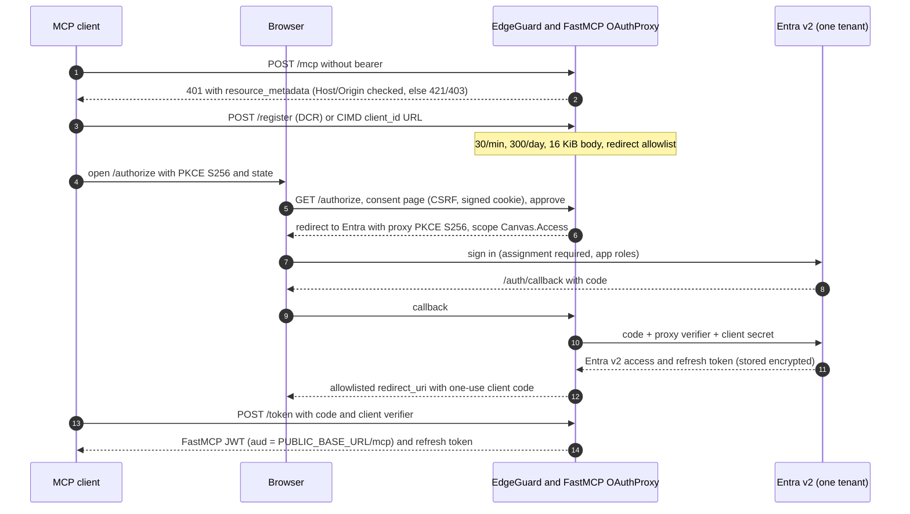
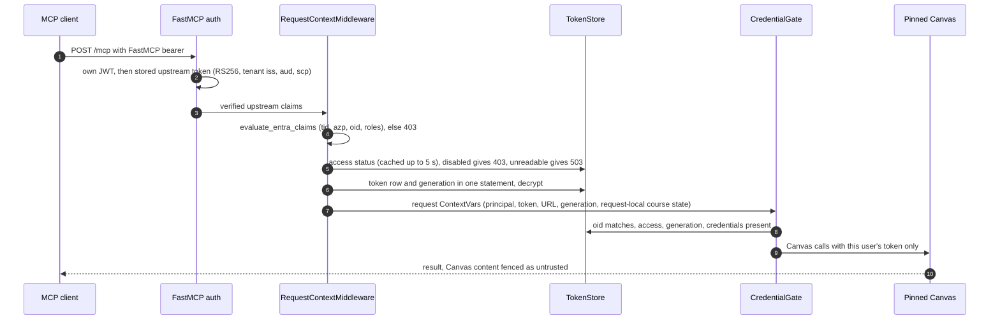

# Stage A appendix: evidence

Paths are relative to the fork root. Tests are cited as `path::Class::test`. The labels are those of the main document: **implemented**, **tested**, **documented** (an operator instruction in `deploy/selfhost/README.md` that the code cannot enforce) and **unverified**.

**Which revision each piece of evidence covers.**

- CI run [37919990444](https://github.com/KKazuhaK/canvas-mcp/actions/runs/37919990444) passed every job on `f32b9d3` (§M). `test-locked` (the `uv.lock` versions: fastmcp 4.0.3, mcp 2.1.1) and `test (3.14)` (unpinned: fastmcp 4.1.0, mcp 2.3.0) each gave 5,905 passed and 29 skipped; `test-windows` gave 5,903 passed and 31 skipped; `test-postgres` (the self-hosted suite on a real PostgreSQL service, outside the pilot) gave 1,991 passed and 65 skipped; `test (3.11)` to `test (3.13)`, `lint`, `web`, `test-code-api`, `verify-confirmation` and the `test-enhancements` aggregator passed too.
- Image run [37919990428](https://github.com/KKazuhaK/canvas-mcp/actions/runs/37919990428) built `f32b9d3` and passed the container smoke test on amd64 and arm64. The published `:edge` multi-arch index is `ghcr.io/kkazuhak/canvas-mcp@sha256:f34608fcceccc63ca6189a3c963f96353cda0e40bda277f559c7b2790e4952d2` (revision annotation `f32b9d3b3418895802d596794f1e2b0709affff6`; linux/amd64 and arm64). The pilot pins it (§I.1).
- Your focused command (§I.2) at `f32b9d3`, run locally on Windows 11 with Python 3.14.7 and the project venv: 2,126 passed, 12 skipped, 0 failed.
- Historical: `c8a4a28` (G3 and G4, before P3, the restart test and the tool switch) has CI run [37913379074](https://github.com/KKazuhaK/canvas-mcp/actions/runs/37913379074) and image run [37913379044](https://github.com/KKazuhaK/canvas-mcp/actions/runs/37913379044); the earlier baseline `b576935` has CI run [37892586282](https://github.com/KKazuhaK/canvas-mcp/actions/runs/37892586282) and image run [37892586465](https://github.com/KKazuhaK/canvas-mcp/actions/runs/37892586465). Numbers marked with these commits are kept for comparison only and do not describe `f32b9d3`.

**Unverified, collected:**

- all live acceptance on claude.ai web (W), Claude Desktop (D), Claude mobile (M) and Claude Code (CC);
- live Entra behaviour: the v2 issuer, the `tid` of B2B guests, the tenant's token lifetime, and Entra's own rotated-refresh-token reuse (the FastMCP proxy's own refresh-token reuse is now tested, §G.2);
- a real JWKS `kid` rollover;
- every FastMCP behaviour marked *read* in §G;
- the concurrent-refresh race (§G.2);
- running the server on Windows (`test-windows` passes the unit suite, and Windows hosting is outside the pilot);
- anonymization coverage of classmates' content in student-role tools;
- your focused command on Linux and Python 3.12 outside CI (it has run only inside CI's full suite and locally on Windows);
- an upgrade of a running deployment's stored OAuth state from one FastMCP version to another.

Contents:

- A. Response to the review of 230788e
- B. Alternatives
- C. Scope, consent, legacy-mode reach
- D. Architecture and sequences
- E. Custody inventory
- F. Threat table
- G. OAuth checklist and FastMCP findings
- H. Dependencies and CI
- I. Acceptance, live checklist, evidence, rollback
- J. Lifecycle detail
- K. Stage B
- L. G3 and G4 test citations
- M. Commits and local verification
- N. Code inventory

## A. Response to the review of 230788e

Of the 35 commits between `230788e` and `b576935`, five carry the review fixes:

- `51ed351` makes revocation an authorization decision;
- `d91e7ca` adds credential generations;
- `3cf72ad` adds the OAuth store, the dependency floor, the custody docs and log sanitizing;
- `4e27d1c` adds the FastMCP/uvicorn scrub, audit masking and an in-process generation check;
- `b576935` replays the stale session with its real CSRF value.

G3, G4, P3 (storage), the restart test and the tool switch come after these (§M).

| Your requirement | What changed | Detail | Status |
|---|---|---|---|
| 1. Revocation is an authorization decision | `principal_status` (disable and enable) is stored apart from the token rows (`token_store.py::TokenStore.disable_principal`). Disable and enable move the session epoch. The status is checked on every `/account` request (`_AccountApp._resolve_session`), inside `TokenStore.put`'s transaction, and at every MCP request and tool call. Self-disconnect and an owner's "remove" stay row deletions and are not revocation. Only an active owner or the operator can re-enable, never the user. Owner status is re-checked on each action. **Your reproduction (enroll, store deletion, re-enroll with the old session) is refused after a disable**: `tests/selfhost/test_account_access_lifecycle.py::TestTheReportedSequence::test_a_stale_session_cannot_restore_a_disabled_users_enrollment`, `::TestTheReportedSequenceWithTheRealCsrf::*`, `::TestOwnersAreCheckedAgain::*`. Your test list is mapped in §A.1. | §J | tested |
| 2. State bound to the credential lifecycle | Each principal has a generation counter that rises with every change. It keys or guards caches, policy decisions, pseudonyms, discussion hints, pending confirmations, health verdicts and refresh tasks. Pending confirmations no longer survive re-enrollment (`test_credential_generation.py::TestPendingConfirmations::test_a_preview_does_not_survive_re_enrollment_at_the_same_school`). A token for another Canvas user needs a confirmation. Reduced permissions and late refreshes are tested (§J). Entra roles gate server access only; Canvas permissions come only from the user's own token. Since G4, course state is request-local by default (§J). | §J | tested |
| 3. OAuth review of actual dependency behaviour | §G has the checklist, with *tested* and *read* marked separately. **The `cull()` failure you saw is fixed** by the `py-key-value-aio>=0.4.6` floor (0.4.5 has no `FileTreeStore.cull`). Product code now passes FastMCP's public `client_storage` (`test_oauth_storage.py::TestProviderWiring::test_the_product_code_does_not_touch_provider_internals`). The compat tests still read private attributes. G3 adds end-to-end tests through the real proxy for code replay, PKCE and refresh-token reuse (§L). CI runs the full suite on fastmcp 4.0.3 (locked) and 4.1.0 (unpinned). **Not shown:** "prove upgrade behavior" beyond that; nothing tests upgrading a running deployment's stored OAuth state, and *read* items were read against 4.0.3 only. | §G, §H | partly tested; gaps listed |
| 4. Custody beyond encrypted SQLite | Inventory and boundary in §E. **The README privacy boundary is corrected**: `deploy/selfhost/README.md` § "Custody and privacy boundary" → "What the encryption does and does not protect", and `SECURITY.md` item 5. | §E | documented |
| 5. Constrained destinations | Only the pinned `CANVAS_API_URL` is used. Multi-school is out of scope. Pagination stays on the same origin. Off-Canvas download hops carry no credentials. Download hops are an accepted residual (§F row 13). | §F | tested; residual stated |
| Your test run (1,062 passed, 1 failed) | `tests/selfhost/test_edge_guard.py::TestStorageLifetimeAndCleanup::test_expired_oauth_records_are_deleted_from_disk` now passes (the `cull()` floor). Your exact command and its expectation are in §I.2. | §I A | tested (in CI, inside the full suite) |

### A.1 Your item-1 test list

| You asked to test | Test | Evidence |
|---|---|---|
| Stale user sessions | `tests/selfhost/test_account_access_lifecycle.py::TestTheReportedSequence::*`, `::TestTheReportedSequenceWithTheRealCsrf::*` (the real CSRF value) | CI |
| Stale owner sessions | `::TestOwnersAreCheckedAgain::*`; `test_principal_access.py::TestOwnerDemotionFromRequestTokens::*` | CI |
| Already-issued MCP tokens and refresh | `tests/selfhost/test_principal_access.py::TestMiddlewareRefusesADisabledPrincipal::test_an_already_issued_and_a_freshly_refreshed_token_are_both_refused`; `tests/test_multiuser_e2e.py::TestOAuthProxyHardening::test_disabling_the_user_stops_the_whole_refresh_family_from_buying_anything` | CI |
| Restarts | Store level: `tests/selfhost/test_principal_status_store.py::TestRestartAndMigration::test_the_decision_survives_a_restart`. Middleware level: `test_principal_access.py::TestMiddlewareRefusesADisabledPrincipal::test_the_decision_survives_a_server_restart`. **Whole process (new):** `tests/test_multiuser_e2e.py::TestMcpAsTwoUsers::test_an_administrative_disable_survives_a_process_restart` builds a fresh token store, access and preference caches, FastMCP server and ASGI app over the same database and OAuth state, for both course-state modes. User A's old bearer and old `/account` session are refused, with no Canvas request; as a control, user B's old bearer and old session still work on the restarted app. | CI (the whole-process test is `bf703a6`) |
| Concurrent enrollment and revocation | `tests/selfhost/test_principal_status_store.py::TestConcurrentEnrollmentAndDisable::*` | CI |

## B. Alternatives considered

| Path | What it solves | What it does not | Relation to this pilot |
|---|---|---|---|
| Local stdio or a per-user local proxy | Remains **the recommended default**, unchanged by this mode | Cloud web and mobile clients | The pilot tests the one thing stdio cannot: per-user access from claude.ai web, Desktop and mobile |
| Standard-header alias | A small, separate PR | An organization-wide static header is not per-user identity | Not pursued here |
| External OAuth gateway with a per-user credential resolver | Could replace `/account` and the OAuth proxy | Still has token custody and identity binding | **Not evaluated here.** The lifecycle contract (§J) and the live checklist (§I.4) are what such a gateway would have to meet. Main document Q3 asks whether you want that evaluation before the pilot. |
| Scoped developer keys (#236) | Least privilege at Canvas | Server authentication | Complementary. PAT support is retained. A developer key would change the Canvas credential, not the identity layer. |
| Full fork stack | n/a | n/a | Not proposed |

## C. Scope, consent, and what reaches legacy modes

### C.1 Pilot scope with citations

| Dimension | Pilot value | Status |
|---|---|---|
| Canvas | `CANVAS_API_URL` only. `CANVAS_FEATURED_SCHOOLS` and `CANVAS_SCHOOL_SEARCH` stay unset. The default host is used verbatim (`schools.py::SchoolPolicy.resolve_stored`). | tested (`test_request_context.py::TestSchoolRouting::test_the_default_host_row_uses_the_default_url_verbatim`) |
| Identity | One tenant GUID. `common`, `organizations` and `consumers` are refused (`settings.py::load_selfhost_settings`). "Assignment required" (README § 1.8) and guests only when invited and assigned (README § 1.9). | GUID-only: tested (`test_settings.py::TestEntraIdentifiers::test_tenant_aliases_rejected`). Assignment required: documented. Guest `tid`: unverified. |
| Process | One container and one uvicorn process (`server.py::_run_selfhost_http_server`) | documented; the compose file is checked by `test_selfhost_compose.py::test_not_scaled_beyond_one_replica` |
| Tools | `CANVAS_ROLE=student`, and no write tool is exposed. Shared write tools are registered, then removed by the HTTP default policy (`server.py::_main_selfhost`: `register_all_tools`, then `apply_tool_policy(resolve_tool_policy(config.allowed_write_tools, "http"))`). Student write tools are not registered without `STUDENT_WRITE_TOOLS`. | tested (`tests/security/test_tool_policy.py::test_http_default_leaves_only_read_tools`) |
| `execute_typescript` | Startup refuses it (`app.py::validate_selfhost_startup`) | tested |
| Hosted file writes | `download_course_file` (`LOCAL_WRITE`) is removed by the HTTP default | tested |
| Result truncation | Off with `MCP_MAX_RESULT_CHARS=0`. Otherwise the code default of 140,000 applies to every non-Claude-Code HTTP client (`config.py`, `tool_results.py::result_cap_limit`, `mcp_client.py::client_needs_result_cap`). | implemented |
| `read_course_file_text` | A fork-only read tool. **Pilot default: excluded** with `SELFHOST_DISABLED_TOOLS=read_course_file_text` (`ff230fa`). It parses PDF, PPTX and DOCX content written by other people (actor A2) with pypdf, python-pptx and python-docx inside the process that holds the key ring. Including it is an open question (main document Q5). `read_course_file`, an upstream tool rewritten in the fork, stays, and the exclusion does not remove the parser exposure: for clients that cannot receive file blobs (the `claude-ai` client name used by claude.ai connectors and Desktop chat, and any unnamed HTTP client that is not Claude Code; `mcp_client.py::client_mishandles_file_blobs`) it extracts the full text with the same parsers (`files.py::_file_as_text_fallback` -> `file_text.py::extract_document`), and for Claude Code it counts PDF pages with pypdf (`files.py::_pdf_page_count`), all in worker threads of the same process. It returns content in the response and writes nothing to disk. It and `read_course_file_text` are the SSRF-relevant tools (§F row 13). | removal and refusal tested (CI, §L); the parser exposure itself is not assessed |
| Anonymization | `ENABLE_DATA_ANONYMIZATION=true` (the image default in `Dockerfile.selfhost`), kept on | implemented; coverage unverified |
| Course state | `SELFHOST_COURSE_STATE=request_local`, the default (G4, §J.5) | tested (CI at `f32b9d3`, §L) |
| Storage | `DATABASE_URL` unset, so the store is the SQLite file `/data/canvas-mcp/tokens.sqlite3` (`db/url.py::default_sqlite_path`), reached through the P3 repositories (`core/selfhost/db/`). P3's PostgreSQL backend is a fork feature outside the pilot. | tested (`tests/selfhost/test_database_settings.py::TestDefault::test_unset_and_empty_keep_the_sqlite_file_in_the_data_directory`) |

**Pilot `.env`** (moved here from the main document):

```dotenv
MCP_AUTH_MODE=entra-oauth
PUBLIC_BASE_URL=https://<pilot-host>
ENTRA_TENANT_ID=<tenant GUID>
ENTRA_CLIENT_ID=<app GUID>
ENTRA_CLIENT_SECRET=<secret>
OAUTH_JWT_SIGNING_KEY=<openssl rand -base64 48>
ACCOUNT_SESSION_SECRET=<base64 of >= 32 random bytes>
CANVAS_TOKEN_KEYS=k1:<openssl rand -base64 32>
CANVAS_API_URL=https://<pinned-canvas-host>/api/v1
CANVAS_ROLE=student
FASTMCP_HOME=/data/fastmcp
ENABLE_DATA_ANONYMIZATION=true
MCP_MAX_RESULT_CHARS=0          # truncation off; env.example sets 140000
LOG_ACCESS_EVENTS=true
SELFHOST_COURSE_STATE=request_local   # the default; per_principal is not used in the pilot
SELFHOST_DISABLED_TOOLS=read_course_file_text
# DATABASE_URL stays unset: SQLite in /data (PostgreSQL is not part of the pilot)
```

**Must stay unset:**

- refused at startup (seven, `app.py::validate_selfhost_startup`): `CANVAS_API_TOKEN`, `MCP_ACCESS_KEYS`, `ENTRA_AUTH_ENABLED`, `MCP_ALLOW_UNAUTHENTICATED`, `ACCESS_REQUEST_ENABLED`, `FASTMCP_SSRF_TRUST_PROXY`, and `EXECUTE_TYPESCRIPT_ENABLED` when true (or `execute_typescript` named in `ALLOWED_WRITE_TOOLS`);
- `ALLOWED_WRITE_TOOLS` and `STUDENT_WRITE_TOOLS`;
- `CANVAS_FEATURED_SCHOOLS` and `CANVAS_SCHOOL_SEARCH`;
- `OAUTH_ALLOWED_REDIRECT_URIS`;
- `DATABASE_URL` (pilot choice: SQLite) and `SELFHOST_STATE_BACKEND` (`redis` is reserved and refused at startup).

**`SELFHOST_DISABLED_TOOLS`** (implemented, `ff230fa`). Parsed in `core/selfhost/settings.py`: names are trimmed, lowercased, de-duplicated and checked against the known tool registry. An unknown name stops startup, and the message lists only the unknown names; an entry not shaped like a tool name is counted but not echoed. `app.py::apply_disabled_tools` runs from `server.py::_main_selfhost` after `apply_tool_policy`. It only removes tools: it never adds one or widens `ALLOWED_WRITE_TOOLS`. `--config` prints "Disabled tools: ...", and the start log line records the count. `ff230fa` does not touch `token_store.py` or `core/selfhost/db/`. Documented in `deploy/selfhost/env.example` (commented, off by default), README § "Disabling tools", and the CHANGELOG. Tests: §L.

**Not part of this proposal:**

- multi-school discovery and enrollment;
- per-user write opt-in (`core/selfhost/tool_prefs.py`, `/account/write-tools`);
- result truncation;
- the React account UI (`web/`, built into the image but not served);
- the `documents` extra, and `read_course_file_text` as a feature;
- the optional PostgreSQL backend (`DATABASE_URL=postgresql+psycopg://...`, `deploy/selfhost/docker-compose.postgres.yml`, the `postgres` extra) and the SQLite-to-PostgreSQL import.

### C.2 Consent and authority

- **Owner and users.** The operator and pilot owner is the fork author (@KKazuhaK). The proposed test users are the author plus at most five named students who reply "I agree" to the text below. Names are not posted publicly; the count is. The author using the fork alone, with only the author's own accounts, is not the pilot and involves no other person's credentials. The pilot starts with the first other user, only after G1 and G2.
- **Canvas.** One institution's Canvas, to be named on #484 before anyone else enrolls (the README examples use `canvas.eee.uci.edu`). This document records **no institutional approval** for storing student personal access tokens on a third-party server. G2 blocks other users until that institution's position, and its rules on education records (FERPA in the US), are recorded.
- **Third-party content.** Student-role tools return content from people who did not consent: classmates' discussion posts, peer-review material, instructor messages and announcements. The server is not designed to write Canvas content to disk: the container's root filesystem is read-only and `/tmp` is a tmpfs (`deploy/selfhost/docker-compose.yml`, checked by `test_selfhost_compose.py::test_container_is_hardened`), and the hosted file-write tool is removed. The `/data` volume is writable (token store, OAuth state, audit log), and no test shows that no Canvas content reaches it. Anonymization is on, but whether it covers all of this output is unverified. The consent text asks users not to share that content.
- **Tenant.** The operator's tenant only, with "Assignment required = Yes" (README § 1.8). B2B guests are allowed only when the operator invites one individually and assigns the role (README § 1.9). There are no tenant-wide or self-service grants. Guest tokens are expected to carry the pilot tenant's `tid` (unverified live).

> You are joining a short test of a self-hosted Canvas connector run by <operator> on <host>. It is experimental and not an official canvas-mcp service.
> - You store your own Canvas access token on this server. It is encrypted, but **the operator and anyone with access to the server and its keys can decrypt it and act in Canvas as you.**
> - The tools only read Canvas. Everything they read (courses, grades, messages, files, classmates' posts) passes through this server's memory and through your AI provider. The server is not designed to store Canvas content on disk. An optional log records your Microsoft account id and short codes, not content. Do not share classmates' or instructors' content outside your chat.
> - The server keeps your Microsoft display name and e-mail, your Canvas user id and name, and timestamps, in plain text.
> - Create a dedicated Canvas token with an expiry date. To leave, use "Delete my token" at /account **and** delete the token in Canvas (Account → Settings → Approved Integrations). Only the Canvas side makes the token useless.
> - The operator can disable your access at any time. You can withdraw at any time. Reply "I agree" to <operator> before you enroll.

### C.3 Inactive by default, and what reaches legacy modes

**The mode switch** (implemented, tested). `settings.py::auth_mode` returns `legacy` when `MCP_AUTH_MODE` is unset, empty or `legacy`. Any other value except `entra-oauth` stops startup. `server.py::main` decides before any legacy branch runs, and with `MCP_AUTH_MODE` unset the legacy auth branches are unchanged. Tests:

- `tests/selfhost/test_settings.py::TestAuthMode::*`
- `tests/selfhost/test_startup.py::TestLegacyUntouched::*`
- `tests/test_multiuser_e2e.py::TestLegacyHttpModeUnchanged::*` and `::TestStdioModeUnchanged::*`
- the legacy section of `deploy/selfhost/smoke-test.sh`

`SELFHOST_COURSE_STATE` (G4) and `SELFHOST_DISABLED_TOOLS` are read only by `load_selfhost_settings`, so the other auth modes do not read them. The request-local dict is created only by `SelfhostRequestContextMiddleware`.

Legacy startup imports some selfhost modules:

- `server.py` imports `core/selfhost/settings.py`, which imports `schools.py` and `db/url.py` (through the standard-library-only `db/__init__.py`, which imports only `db/url.py` and `db/errors.py`);
- `tools/discovery.py` imports `tool_prefs.py`, which imports `token_store.py`, which imports `db/errors.py`;
- `core/client.py` imports `schools.py` lazily, for uploads.

These modules need only the standard library, `anyio`, `httpx` and `cryptography`. SQLAlchemy and Alembic (the `selfhost` extra) and psycopg (the `postgres` extra) load only when a store is built; with those packages blocked, the upstream modes still import and run (`tests/selfhost/test_dependency_isolation.py::test_the_legacy_stdio_and_access_key_configuration_never_loads_the_data_layer`, `::test_the_server_and_every_non_database_module_import_without_the_extras`).

**Fork changes that reach legacy modes**, compared with upstream main `8f1b0ae`. These are fork features or Stage B candidates, not part of this proposal:

- result truncation at 140,000 characters for non-Claude-Code HTTP clients (`server.py` calls `install_tool_result_contract` in every mode);
- the new read tool `read_course_file_text` in every mode (`tool_policy.py` READ entries go from 71 to 72);
- upload destination checks on every HTTP request (`client.py::_upload_destination_refusal` via `selfhost/schools.check_public_host`), and refusal of an off-origin confirm redirect in `upload_file_to_storage`;
- the rewrites of `core/cache.py`, `core/course_files.py` and `tools/files.py`, and the `missing_credentials_message` text;
- the log and audit scrub in `core/redact.py`;
- P3 does not reach these modes: its extras are optional, and the data layer is never imported there (above);
- G4 touches the shared `core/credentials.py`, `core/cache.py`, `core/course_policy.py`, `core/anonymization.py` and `tools/discussions.py`. The predicate `uses_request_local_course_state()` is true during an HTTP request with no principal (the upstream-compatible modes), and false in stdio (`tests/selfhost/test_course_state_modes.py::TestMode::test_the_predicate_by_mode`). The new per-request dict is set only for a verified principal in request-local mode.

## D. Architecture and sequences

| Component | Code | Role |
|---|---|---|
| `SelfhostEdgeGuard` | `core/selfhost/edge_guard.py` (buckets in `limits.py`) | Pins the scheme to https. Rate-limits `/register` and `/authorize`, and caps registration bodies at 16 KiB. Runs an **opportunistic cull, at most hourly, triggered only by `/register` or `/authorize` requests** (`_schedule_maintenance`, `MAINTENANCE_INTERVAL_SECONDS`). |
| FastMCP `http_app` | `app.py::build_selfhost_asgi_app` | Stateless streamable HTTP with `host_origin_protection=True`; host and origin come from `PUBLIC_BASE_URL`. Wires `course_state` from settings into the middleware (G4). |
| OAuth proxy | FastMCP 4.0.3 `AzureProvider`, built in `oauth.py::build_entra_auth_provider` | DCR, CIMD, `/authorize`, `/consent`, `/auth/callback`, `/token`; bearer verification |
| `OAuthStorage` | `oauth.py::OAuthStorage` | Fernet-encrypted file store under `FASTMCP_HOME/oauth-proxy/<key fingerprint>/` |
| Request context and gate | `request_context.py` (`SelfhostRequestContextMiddleware`, with a `course_state` argument since G4), `tool_gate.py` | Claim policy, access status and credential lookup per request. The checks repeat at each tool call and resource read. |
| `/account` | `account_web.py` | OIDC sign-in, token enrollment, owner administration |
| `TokenStore` | `token_store.py`, over the repositories in `db/` (SQLAlchemy Core; schema by Alembic) | AES-256-GCM tokens, `principal_status`, events, generations. Encryption and AAD stay in `token_store.py`; `db/` sees only ciphertext. |

### D.1 MCP OAuth sign-in



A missing `code_challenge`, or any method other than S256, is refused at the `/authorize` step before consent (§L, G3).

### D.2 `/account` enrollment

1. `GET /account/login` redirects to Entra with PKCE S256, state, nonce and a sealed 600 s login cookie.
2. The callback compares the state, clears the cookie and exchanges the code.
3. The `id_token` is verified: RS256 against the JWKS, `iss`, `aud = client_id`, nonce, `iat` within 600 s, `exp`, `tid`, `oid` and roles.
4. `record_sign_in` returns the status and the session epoch. The server sets a sealed `__Host-` session cookie (default 900 s).
5. `POST /account/token` requires CSRF and the same Origin. The status is re-read without caching. The submitted token goes to `GET /users/self` without following redirects.
6. `TokenStore.put` encrypts with AAD (principal, host, key id) and raises the generation inside one transaction. It refuses if the principal is disabled.

### D.3 A tool call



## E. Custody inventory

This condenses README § "Custody and privacy boundary". Encryption protects a leak of the database, or of a backup on its own, without `.env`. It does not protect against a compromised runtime, or against anyone who holds both `.env` and `/data`: the operator, host root, the Docker group, or a backup holding both. Such a person can decrypt every token and act in Canvas as that user. The owner pages never show a token, but that is a UI restriction, not a cryptographic one. A database-only leak exposes the plaintext metadata.

| Asset | Where | Readable by | Rotation | Deletion and residue |
|---|---|---|---|---|
| Canvas PAT (per user) | `/data/canvas-mcp/tokens.sqlite3` (the pilot leaves `DATABASE_URL` unset), AES-256-GCM, AAD `principal_key, host, key_id` (`token_store.py::_aad_v2`). In process memory during each request. | The process; whoever holds `CANVAS_TOKEN_KEYS` and the volume | The user enrolls a new token. Key ring: `token_admin rotate`. | `TokenStore.delete`. Bytes may survive in SQLite free pages, the WAL and backups. Only revocation in Canvas makes a token worthless. |
| `CANVAS_TOKEN_KEYS` | `.env`, container environment | Root, the Docker group, the process | New key first, then `rotate`, then drop the old key. Startup refuses a key ring that is missing a key id in use (`TokenStore._verify_keyring`). | Remove from `.env` |
| Upstream Entra access and refresh tokens | `/data/fastmcp/oauth-proxy/<fingerprint>/`, Fernet with a key derived from `OAUTH_JWT_SIGNING_KEY` | The process; whoever holds the signing key and the volume. With `ENTRA_CLIENT_SECRET`, the refresh token yields new tokens for this app (not for Canvas). | A new signing key moves state to a new directory, and clients reconnect. Entra "Revoke sessions" stops refresh. | Opportunistic cull of expired records (`oauth.py::cull_expired_oauth_state`, current directory only). **After rotation the old fingerprint directory stays, holding old refresh tokens under the old key. Delete it manually and discard the old key.** |
| DCR registrations, transactions, codes | Same store | Same | n/a | DCR records get a 30-day TTL when FastMCP gives none (`DCR_CLIENT_TTL_SECONDS`). Same cull. |
| `OAUTH_JWT_SIGNING_KEY` | `.env` | As above | Edit `.env` and recreate the container | Rotation leaves the old fingerprint directory (see above) |
| `ACCOUNT_SESSION_SECRET` | `.env` | As above. **Owner-equivalent**: it can forge a session for any user. | Edit `.env`; open sessions end | n/a |
| `/account` session cookie | Browser (`__Host-cmcp_session`, AES-GCM, `_CookieCodec`) | The browser; holders of the secret | TTL of 60 to 3600 s (default 900), enforced server-side. Disable or enable kills it (epoch). | Logout is client-side. A copied cookie lives until `exp` unless the epoch changes. |
| `ENTRA_CLIENT_SECRET` | `.env`; Entra | As above | A new secret in Entra | Delete in Entra |
| Plaintext DB metadata | Principal key, Entra name and UPN, Canvas id and name, host, timestamps, health, access history | Anyone with the volume | n/a | Kept so that a disablement stays in force. No purge command (README § Retention). |
| Audit log (`LOG_ACCESS_EVENTS=true`) | `/data/audit/audit.jsonl` and stderr. Principal keys and codes; endpoints masked (`audit.py::_sanitize_endpoint`). | Volume and log readers | 10 MB × 6 files | Rotation |

**State held only in memory**, lost on restart (README, the paragraph after the inventory table):

- in every mode: access and token-health verdicts, pending write confirmations, the generation registry (not in the README list), and each request's decrypted token (`RequestCredentials.api_token` is `repr=False`);
- only with `SELFHOST_COURSE_STATE=per_principal`: the course caches, course-policy decisions, pseudonym maps and discussion hints. With the pilot's `request_local` they live only inside one request.

## F. Threat table

Actors:

- A1 another pilot user;
- A2 a malicious Canvas content author (prompt injection);
- A3 a malicious MCP client registrant;
- A4 a network attacker;
- A5 operator or host compromise;
- A6 an Entra admin mistake.

Trust zones T1 to T5 are as in the main document's diagram.

| # | Threat | Mitigation (code) | Status: primary evidence | Residual |
|---|---|---|---|---|
| 1 | Host spoofing, cross-origin POST (T1) | `host_origin_protection` in `app.py`; uvicorn `proxy_headers=False` | tested: `test_oauth_wiring.py::TestHostAndOriginProtection::*` | The proxy must forward `Host` (documented) |
| 2 | Flooding `/register` or `/authorize` (A3) | Global buckets of 30/min and 300 registrations/day, a 16 KiB cap, DCR TTL, opportunistic cull | tested: `test_edge_guard.py::TestRegistrationLimits::*` | A flood also blocks legitimate users. Per-IP limits exist only in the proxy (documented). |
| 3 | OAuth secrets in logs | `access_log=False`; `SecretScrubFilter` on the app, FastMCP, `mcp` and uvicorn handlers (`logging.py::scrub_third_party_logs`) | tested: `tests/core/test_redact.py::TestThirdPartyLoggers::*` | **The scrub matches labelled shapes only.** FastMCP logs bare transaction ids. On failed lookups it logs bare, already-invalid authorization codes (fastmcp 4.0.3 `oauth_proxy/proxy.py`: `logger.error("Authorization code not found in client codes: %s", ...)`, plus debug lines). Proxy and CDN logs are the operator's job. |
| 4 | Foreign bearer, forged claims snapshot (T5) | Only FastMCP-issued JWTs are accepted. Claims come from re-verifying the stored upstream token. | tested: `tests/test_fastmcp_compat.py::test_oauth_proxy_returns_verified_upstream_claims_not_the_snapshot` | Depends on `OAuthProxy.load_access_token`. The compat tests use private attributes. |
| 5 | Wrong tenant, client or role (A6) | `identity.py::evaluate_entra_claims` checks `tid`, `azp`, a GUID `oid`, and `roles` as a list | tested: `test_identity.py::TestAccess::*`, `test_multiuser_e2e.py::TestRefusedUsers::*` | Role removal waits for the token lifetime (row 15) |
| 6 | Cross-user state (A1) | Keys `principal\|api_url\|g<generation>` (`credentials.py::current_principal_key`). **G4:** with `SELFHOST_COURSE_STATE=request_local` (the default), the course list, aliases, policy decisions, pseudonyms and discussion hints go to a per-request dict created by `SelfhostRequestContextMiddleware`, instead of the process-wide maps (`_policy_cache`, `_anonymization_cache`, `_unservable_topics`); the selectors `_policy_store()`, `_principal_cache()` and `_unservable_store()` pick the request dict when it is set. | tested: `test_isolation.py::*`, `test_multiuser_e2e.py::TestMcpAsTwoUsers::*` (run once per course-state mode); G4 tests in §L (CI) | Pending write confirmations, access and health verdicts, and the generation registry stay process-wide in every mode; a preview must outlive its request. With `per_principal` (opt-in, not used in the pilot), generation-keyed process-global caches return. |
| 7 | Using another user's token (A1) | Lookup by verified `tid`/`oid`; AAD binds the principal; the gate requires bearer `oid` = principal | tested: `test_token_store.py::TestAadV2Binding::*`, `test_tool_gate.py::TestToolCalls::test_principal_and_token_oid_mismatch_is_refused` | none known |
| 8 | Fallback to a server credential | Startup refuses `CANVAS_API_TOKEN`, `MCP_ACCESS_KEYS`, `ENTRA_AUTH_ENABLED`, `MCP_ALLOW_UNAUTHENTICATED`, `ACCESS_REQUEST_ENABLED` and `execute_typescript`. `make_canvas_request` fails closed in HTTP. | tested: `test_startup.py::TestRefusals::test_forbidden_legacy_settings` | none known |
| 9 | Prompt injection (A2) | No write tool exposed, no `execute_typescript`, no local writes; content fenced (`untrusted_content.py`, upstream); `read_course_file_text` excluded in the pilot | tested only that no write tool is exposed: `test_tool_policy.py::test_http_default_leaves_only_read_tools`; the exclusion: `tests/selfhost/test_disabled_tools.py::TestWholeStack::*` (CI) | **The model can still disclose what it reads**, in its answer or through another connector |
| 10 | Malicious client obtains a code (A3) | Redirect allowlist (`settings.py::DEFAULT_REDIRECT_URIS`), consent required, PKCE S256 (SDK `AuthorizationRequest` model), one-use codes | tested: `test_oauth_wiring.py::TestClientRegistration::*`; G3: `test_multiuser_e2e.py::TestOAuthProxyHardening::*` (CI) | Loopback redirects match any port. No adversarial consent test. A replayed code is refused but **does not revoke the tokens the first redemption issued**. A wrong `code_verifier` does not burn the code (not exploitable with S256). |
| 11 | SSRF via CIMD `client_id` (A3) | FastMCP `ssrf_safe_fetch_response` (DNS pinning, IP blocklist). **G3:** `validate_selfhost_startup` refuses `FASTMCP_SSRF_TRUST_PROXY`, which would disable those checks. | The refusal is tested (`test_startup.py::TestRefusals::test_fastmcp_ssrf_trust_proxy_is_refused_for_any_truthy_value`, `::TestSsrfTrustProxy::*`, CI). The fetch checks are *read*, with no test here. | No CIMD SSRF test (handed to the reviewer) |
| 12 | `/account` CSRF, forged or replayed session | Sealed `__Host-` cookies, CSRF plus exact Origin, CSP, no JS; status and epoch re-read per request | tested: `test_account_web.py::TestSaveToken::test_missing_csrf_is_403`, `test_account_access_lifecycle.py::TestTheReportedSequenceWithTheRealCsrf::*` | A copied cookie works until `exp` unless the epoch changes |
| 13 | Token or request sent off the pinned Canvas (T2→T4) | The pinned URL is used verbatim. Pagination refuses another origin's `next` link. `/users/self` probes do not follow redirects. Off-origin download hops carry no credentials (`course_files.py::stream_file_download`). | tested: probe `test_token_health.py::*::test_the_probe_goes_to_the_users_own_school_without_following_redirects`; pagination `tests/core/test_client_state_machine.py::test_pagination_cannot_redirect_credentials_or_change_endpoint`; download hops without credentials `tests/core/test_course_files.py::TestDownloadTokenBoundary::test_non_canvas_first_hop_never_sees_the_token`, `tests/security/test_file_tool_host_boundary.py::TestDownloadTokenBoundary::test_chained_redirects_off_canvas_never_carry_authorization` | **Off-Canvas file-download hops are not DNS/IP-restricted.** They require https and at most `MAX_DOWNLOAD_REDIRECTS` (5) hops, then fetch whatever host Canvas or its storage redirects to, and the body reaches the model. `read_course_file` and `read_course_file_text` are therefore the SSRF-relevant tools. This is accepted for the pilot because the redirect source is the operator's pinned Canvas, and upstream's `read_course_file` follows redirects without any host check today. An egress firewall would mitigate it but is not documented. |
| 14 | Token for a different Canvas user; stale state (A1) | A confirmation for an identity change (`_AccountApp.save_token`); generation +1 | tested: `test_account_token_health.py::TestIdentityChange::*` | A dispatched Canvas call is not cancelled |
| 15 | Entra removal while access continues (A6) | Local disable is the immediate control. A failed refresh cuts the user off. | tested (fake Entra): `test_multiuser_e2e.py::TestRefreshAndRevocation::test_once_entra_refuses_the_refresh_the_user_is_cut_off` | **Bounded by the tenant's access-token lifetime.** Microsoft's default is 60 to 90 minutes, which is not a ceiling. The code sets and checks no lifetime. |
| 16 | Over-broad Entra configuration (A6) | Tenant GUID, scope and distinct roles are required; roles are always checked | tested: `test_settings.py::TestEntraIdentifiers::*` | "Assignment required" and v2 tokens are documented only |
| 17 | Operator or host compromise (A5) | Out of reach. POSIX modes 0700/0600 on the SQLite directory and file (`db/engine.py::Database.prepare_storage`, `::Database.tighten_storage`); hardened container. | config checked (a compose-file lint): `test_selfhost_compose.py::test_container_is_hardened` | **Full.** Stated in the consent text. |
| 18 | Unrecorded access changes | Every disable, enable and owner change is written to `principal_status_events` in the same transaction | tested: `test_principal_status_store.py::TestHistory::*` | Enrollment writes no audit event |
| 19 | A stale owner flag defeats the last-owner guard | Demotion at sign-in or by a newer request token; owner actions need a sign-in within 10 min | tested: `test_principal_access.py::TestOwnerDemotionFromRequestTokens::*` | A former owner who never returns still counts. Break-glass: `--allow-last-owner`. |
| 20 | A leaked MCP refresh token (A3, A4) | FastMCP rotation, so reuse of a rotated token is refused before Entra is contacted. A refresh token cannot be redeemed by another client. Disable stops every token of the user. | tested (G3, CI): `test_multiuser_e2e.py::TestOAuthProxyHardening::test_a_rotated_refresh_token_is_refused_but_its_family_is_not_revoked`, `::test_a_refresh_token_cannot_be_redeemed_by_another_client`, `::test_disabling_the_user_stops_the_whole_refresh_family_from_buying_anything` | **No family revocation.** A leaked copy works until its owner refreshes first, and neither the owner's newer tokens nor anything the thief already obtained is cancelled. Two simultaneous refreshes of one token may both succeed (read, untested). |

**Residual risks, collected.** G4 resolved the earlier item "per-principal caches remain until G4" for the pilot's default.

1. FastMCP logs bare transaction ids and, on failed lookups, bare (already invalid) authorization codes.
2. The last-owner guard counts stale owner flags.
3. A change made by another process (the CLI) reaches the server within 5 s.
4. Entra removal waits for the tenant's access-token lifetime.
5. Off-Canvas download hops are not DNS/IP-restricted.
6. Consent, CIMD/SSRF and the other items marked *read* in §G are FastMCP 4.0.3 behaviour pinned by `uv.lock`, checked by reading. Code replay, PKCE and rotated-refresh reuse are tested in CI on 4.0.3 and 4.1.0 (and locally on 4.0.10).
7. There is no refresh-token family revocation, and a replayed code does not revoke the tokens already issued. A concurrent-refresh race is possible (read, untested); it is the one open item next to G3. The effective cut-off is the server's own access decision (disable).
8. The operator can decrypt every token.
9. The model can disclose what it reads.
10. Global rate limits let a flood degrade service for everyone.

## G. OAuth checklist (your item 3)

"Read" means checked by reading the locked wheels, fastmcp-slim 4.0.3 and mcp 2.1.1. "Tested" cites a fork test. G3 tests run in CI at `f32b9d3` (as at `c8a4a28`) on fastmcp 4.0.3 and 4.1.0.

| Item | MCP path | `/account` path | Status | Open |
|---|---|---|---|---|
| Signature, JWKS | FastMCP verifies its own JWT, then the upstream token (`JWTVerifier`, RS256, tenant JWKS; 1 h cache; an unknown `kid` refetches) | Same verifier (`_default_verifier`) | tested: `test_fastmcp_compat.py::test_oauth_proxy_rejects_tokens_it_did_not_issue` | No real `kid` rollover. The refetch is not rate-limited. `nbf` is not checked (read). |
| Issuer, audience | `.../<tid>/v2.0`. Upstream `aud` ∈ {`client_id`, `api://client_id`}. FastMCP JWT `aud` = `PUBLIC_BASE_URL/mcp`. | `aud = client_id` | tested | Live v2 issuer |
| Tenant, authorized client | `tid` and `azp == ENTRA_CLIENT_ID` (`evaluate_entra_claims`) | `tid`; id_token `aud` | tested: `test_identity.py::TestAccess::*` | Guest `tid` (live) |
| Scope and roles | `scp ⊇ Canvas.Access` (FastMCP `required_scopes`), plus roles (ours) | Roles (`authorize_id_token_claims`) | tested | — |
| Wrong token type, app-only | `/mcp` refuses Entra-issued bearers. An app-only token is refused by `required_scopes` (no `scp`) and by the role check. **`azp` alone would not refuse a token issued to this app itself.** | An access token in place of an id_token has no nonce and is refused | tested: `test_multiuser_e2e.py::TestRefusedUsers::test_a_bearer_issued_by_entra_itself_is_never_accepted` | No app-only test; `idtyp` is not checked |
| PKCE both legs | The SDK `AuthorizationRequest` model requires S256. The proxy-to-Entra leg uses its own S256 pair. | S256 in `login` | tested (the fake Entra requires the verifier). **G3:** missing challenge, `plain`, `S512`, `s256` and empty refused; missing and wrong verifier at `/token` refused (§L). | — |
| One-use code, state, nonce | FastMCP deletes the client code on exchange | Sealed login cookie, cleared on callback. Replay is bounded by Entra's one-use code. | tested for `/account`. **G3:** code replay at `/token` gives `invalid_grant`, with no tokens and no second Entra exchange; another client's id cannot redeem (§L). | First-redemption tokens are not revoked (RFC 6749 only says SHOULD) |
| Exact redirects | Allowlist without wildcards. Loopback matches any port (FastMCP). The redirect at `/token` must equal the one at `/authorize` (SDK, read). | Fixed callback | tested: `test_oauth_wiring.py::TestClientRegistration::*` | CIMD against the allowlist (read) |
| Resource binding | JWT `aud` = resource; `resource` must match when sent (read) | n/a | tested: `::TestDiscovery::test_protected_resource_metadata` | `resource` absent |
| Refresh replay | FastMCP rotates and deletes the old refresh token. Our access decision ignores tokens. | n/a | tested: `test_principal_access.py::TestMiddlewareRefusesADisabledPrincipal::test_an_already_issued_and_a_freshly_refreshed_token_are_both_refused`. **G3:** reuse refused, family not revoked (§L). | **No family revocation** (finding). Concurrent refresh untested. Entra's own rotated-token reuse is unverified live. |
| Consent, confused deputy | FastMCP consent with CSRF and a signed cookie (read); `require_authorization_consent=True` | n/a | The e2e tests pass through `/consent` | Adversarial tests (reviewer) |
| DCR, CIMD, SSRF | Our limits and TTL; CIMD via `ssrf_safe_fetch_response` (read). **G3:** `FASTMCP_SSRF_TRUST_PROXY` refused at startup. | n/a | Tested for the limits and the startup refusal only | SSRF test (reviewer) |
| SEP-990 ID-JAG | Not configured (`identity_assertion` not passed) | n/a | implemented | Unreachable? (reviewer) |

### G.1 Closed before the pilot (G3)

Done on `uci-student` at `c8a4a28` (CI run 37913379074), and still green at `f32b9d3` (CI run 37919990444).

- [x] `validate_selfhost_startup` refuses `FASTMCP_SSRF_TRUST_PROXY`. Commit `8d8ee28`.
- [x] A test replays an MCP authorization code at `/token` and expects `invalid_grant`. Commit `1f3a97d`.
- [x] A negative test for `/authorize` without `code_challenge`. Commit `1f3a97d`.
- [x] A test reuses a rotated FastMCP refresh token and records whether the family is revoked: it is not. Commit `1f3a97d`, README `01604b3`.

### G.2 FastMCP findings from the G3 tests

These were observed locally on FastMCP 4.0.3 (a venv built from `uv.lock`) and 4.0.10 (the shared dev venv), and the tests pass in CI on 4.0.3 (`test-locked`) and 4.1.0 (`test (3.14)`).

- **No refresh-token family revocation.** Reuse of an already-rotated refresh token is refused with `invalid_grant` before Entra is contacted. The newer refresh token and all access tokens, from before and after the rotation, stay valid, so reuse is not treated as theft. The only effective cut-off is the server's own access decision (disable). The test asserts the actual behaviour, and the README states it.
- A replayed authorization code is refused with `invalid_grant`, but the tokens already issued by the first redemption are not revoked. RFC 6749 only says SHOULD revoke.
- FastMCP's `TokenHandler` rewrites a 400 `invalid_grant` to HTTP 401 (`fastmcp/server/auth/auth.py`, following the MCP convention). The tests accept 400 or 401 and require `error == invalid_grant`.
- A wrong `code_verifier` at `/token` returns `invalid_grant` but does not burn the code: the correct verifier can still redeem it afterwards. This is not exploitable with S256.
- PKCE is enforced by the MCP SDK `AuthorizationRequest` model. A missing `code_challenge`, or any method other than S256, gives `invalid_request` before any consent or Entra step. It is delivered as a redirect to the registered `redirect_uri`, or as a 400 JSON if the client or redirect is unknown.
- **Possible race, read only, not tested.** `exchange_refresh_token` loads the old refresh token at the start and deletes it only at the end, with no lock. Two simultaneous refreshes of the same token could both succeed and yield two valid refresh tokens. The README says this is untested.

The README records this in § "Custody and privacy boundary" → "How the OAuth proxy treats replayed codes and refresh tokens", and `tests/test_selfhost_docs.py` pins it.

### G.3 Handed to the independent reviewer (G1)

- adversarial consent and CSRF on `/consent`;
- CIMD SSRF;
- the unknown-`kid` refetch rate;
- `nbf` and `idtyp`;
- ID-JAG reachability;
- transparent upstream refresh inside `load_access_token`;
- the concurrent-refresh race in §G.2.
- if you want `read_course_file_text` in the pilot (main document Q5): its PDF, PPTX and DOCX parsing of third-party files inside the process that holds the key ring.

**Reviewer scope:**

- the FastMCP 4.0.3 OAuthProxy as configured in `oauth.py`;
- the token store as the pilot runs it: `token_store.py` and `core/selfhost/db/` on SQLite;
- the Entra app configuration;
- the deployment: compose, proxy, and `.env` with secrets redacted;
- this proposal.

The author provides read access to these, and to a staging host with test-only accounts. The reviewer is not identified, and the author has no candidate. Upstream is asked to recommend someone with OAuth/Entra experience who has not contributed to this code, or to approve one the author proposes later.

## H. Dependencies and CI

**`pyproject.toml` changes versus upstream main.** These would ship to stdio users too, and a Stage C PR 1 would carry them:

- `fastmcp>=4,<5` becomes `>=4.0.3,<5`, the version whose behaviour §G was read against;
- `cryptography>=44.0.0,<51` becomes a direct dependency (it was already transitive), for the token store and cookies;
- `py-key-value-aio[filetree]>=0.4.6,<0.5` becomes a direct dependency (already transitive), for the OAuth store and `cull()`.

P3 adds two **optional** extras, which stdio users do not install: `selfhost` (`sqlalchemy>=2.1.3,<2.2`, `alembic>=1.19,<2`) and `postgres` (`canvas-mcp[selfhost]` plus `psycopg[binary]>=3.3,<4`); the dev group gains the same three. `Dockerfile.selfhost` installs both extras, so psycopg (whose binary wheel bundles libpq) is in the pilot image although the pilot uses SQLite.

The `documents` extra (pypdf, python-pptx, python-docx) and the new dev dependencies (respx, the parsers) belong to fork features outside the proposal. G3, G4, the restart test and the tool switch change no dependency; P3 changes `pyproject.toml` and `uv.lock` as above.

| Package | Range | `uv.lock` (image, `test-locked`) | Unpinned CI `test` (3.14) |
|---|---|---|---|
| fastmcp / fastmcp-slim | `>=4.0.3,<5` | 4.0.3 | 4.1.0 |
| mcp | `>=2,<3` | 2.1.1 | 2.3.0 |
| py-key-value-aio | `>=0.4.6,<0.5` | 0.4.6 | 0.4.6 |
| cryptography | `>=44.0.0,<51` | 50.0.0 | 50.0.2 |
| sqlalchemy (`selfhost` extra) | `>=2.1.3,<2.2` | 2.1.4 | 2.1.4 |
| alembic (`selfhost` extra) | `>=1.19,<2` | 1.20.0 | 1.20.0 |
| psycopg[binary] (`postgres` extra; unused in the pilot) | `>=3.3,<4` | 3.3.6 | 3.3.6 |
| Python | `>=3.11` | image `python:3.14-slim` by digest | 3.11 to 3.14 matrix |

**CI evidence at `b576935`** (historical). The full suite, including `tests/test_fastmcp_compat.py` (no skip markers), passed with 5,526 passed and 19 skipped in two configurations:

- fastmcp 4.0.3 with mcp 2.1.1 (`test-locked`);
- fastmcp 4.1.0 with mcp 2.3.0 (job `test (3.14)` of run 37892586282).

**CI evidence at `c8a4a28`** (historical; run 37913379074, with G3 and G4): 5,668 passed and 19 skipped on both fastmcp 4.0.3 with mcp 2.1.1 (`test-locked`) and fastmcp 4.1.0 with mcp 2.3.0 (`test (3.14)`); `test-windows` 5,666 passed, 21 skipped.

**CI evidence at `f32b9d3`** (run 37919990444): 5,905 passed and 29 skipped on both fastmcp 4.0.3 with mcp 2.1.1 (`test-locked`) and fastmcp 4.1.0 with mcp 2.3.0 (`test (3.14)`); `test-windows` 5,903 passed, 31 skipped; `test-postgres` (the self-hosted suite on a PostgreSQL service; not pilot evidence) 1,991 passed, 65 skipped.

The behaviours marked *read* in §G were checked only against 4.0.3. The `test` and `test-windows` jobs install with `pip install -e ".[documents,selfhost,postgres]"`, so CI does not pin what the image ships. Only `test-locked`, `test-postgres` and `Dockerfile.selfhost` (`uv sync --frozen`) use the lock. Any FastMCP upgrade needs a re-read of §G.

**Entra** (documented, README Step 1):

- one single-tenant app with exactly two Web redirect URIs;
- `api://<client-id>` with `Canvas.Access`;
- `requestedAccessTokenVersion: 2`;
- app roles `Canvas.User` and `Canvas.Owner`;
- **Assignment required = Yes**;
- admin consent;
- a recorded secret expiry;
- the tenant's access-token lifetime policy recorded before the pilot.

| Host requirement | Status | Where |
|---|---|---|
| One replica, one process | documented | compose file; `test_selfhost_compose.py::test_not_scaled_beyond_one_replica` |
| A TLS proxy that forwards `Host`, does no buffering, keeps query strings out of its logs and applies per-IP limits | documented (Host is enforced with a 421) | README Step 4; `test_selfhost_docs.py::*` |
| `PUBLIC_BASE_URL` is an https origin | implemented | `settings.py::_parse_public_base_url` |
| A loopback port, a read-only rootfs, `no-new-privileges`, `cap_drop: ALL`; non-root (`USER 10001:10001`) | Set in the shipped compose file and the image. The operator can edit either. | `test_selfhost_compose.py::*`, `test_selfhost_dockerfile.py::test_runs_as_a_non_root_user` |
| `.env` with mode 600, kept apart from `/data` | documented | README § Keeping secrets and data apart |
| `FASTMCP_SSRF_TRUST_PROXY` unset | **Enforced at startup** (G3, `8d8ee28`). Listed in the env.example must-be-unset block and in README § "Settings that must stay unset" (Step 3). | `app.py::validate_selfhost_startup`, `_FALSE_WORDS`; tests in §L |
| `SELFHOST_COURSE_STATE` is `request_local` or unset | implemented (any other value stops startup, with no echo); `--config` prints the value | `settings.py::load_selfhost_settings`; `test_settings.py::TestCourseState::*` |
| `SELFHOST_DISABLED_TOOLS=read_course_file_text` | implemented (an unknown name stops startup; only removes tools); `--config` prints the list (`ff230fa`) | `settings.py`, `app.py::apply_disabled_tools`; `tests/selfhost/test_disabled_tools.py` |
| `DATABASE_URL` unset (SQLite) | implemented (the default); `--config` prints the token store. A new, empty target next to a SQLite file with data stops startup (`1b7de0b`). | `db/url.py::default_sqlite_path`, `db/transfer.py::refuse_silent_switch`; `tests/selfhost/test_database_settings.py::TestDefault::*`, `tests/selfhost/test_silent_switch.py::TestStartup::*` |

**Image supply chain.** `Dockerfile.selfhost` has a Node stage. It uses `node:24.19.0-alpine` pinned by digest, runs `npm ci --ignore-scripts` from `web/package-lock.json`, then `npm run build && npm run check:dist`. Only static files are copied to `/app/web-dist`, and they are not served. The exposure is npm packages running at build time without install scripts, with their output shipped as inert files. This is accepted for the pilot. Removing the stage needs a Dockerfile edit, which this proposal does not include.

## I. Acceptance, live checklist, evidence, rollback

### I.1 Image (required step)

The shipped `deploy/selfhost/docker-compose.yml` has `image: ghcr.io/kkazuhak/canvas-mcp:latest` and `pull_policy: always`, so every `docker compose up -d` can pull new code. By the tag rules in `.github/workflows/selfhost-image.yml`, `:latest` follows the newest stable tag, `v1.13.0-uci.1`, which is older than `b576935`, and no stable tag contains `b576935`. Historical, for comparison only: the published digest for `b576935` is:

```yaml
image: ghcr.io/kkazuhak/canvas-mcp@sha256:d8a754af748cc2fcee0dc38791dab19b3cd0b6c22cd728ba1a0723da4aa499e5   # b576935, run 37892586465
pull_policy: missing
```

**This digest predates G3 and G4.** It does not refuse `FASTMCP_SSRF_TRUST_PROXY` and has no `SELFHOST_COURSE_STATE`. Also historical: image run 37913379044 published `ghcr.io/kkazuhak/canvas-mcp@sha256:0fe6ca823c5bc7debbbaf030df5a689190c34d93d3a8caa56081fb7b55348b01` (tag `edge`, revision `c8a4a28`), which has G3 and G4 but **not `SELFHOST_DISABLED_TOOLS`**, so it cannot run the pilot configuration.

**The pilot image** is the `:edge` multi-arch index that image run 37919990428 published for `f32b9d3` (revision annotation `f32b9d3b3418895802d596794f1e2b0709affff6`; linux/amd64 and arm64). Set in the compose file:

```yaml
image: ghcr.io/kkazuhak/canvas-mcp@sha256:f34608fcceccc63ca6189a3c963f96353cda0e40bda277f559c7b2790e4952d2   # f32b9d3, run 37919990428
pull_policy: missing
```

It contains the `selfhost` and `postgres` extras (SQLAlchemy, Alembic, psycopg); with `DATABASE_URL` unset it uses SQLite. Alternatively, build from source with I.3 and set `image: canvas-mcp:pilot`. Record the digest in the evidence either way. The image is published by the fork's CI for this pilot. It is software, not a hosted service, and nobody else is invited to run it.

### I.2 A. Tests

First, your command on Linux and Python 3.12. It is unverified outside CI. The sync line is the `test-locked` sync line, with `--python 3.12` in place of its `UV_PYTHON=3.14`.

```bash
git clone https://github.com/KKazuhaK/canvas-mcp && cd canvas-mcp && git checkout f32b9d3
uv sync --locked --extra documents --extra selfhost --extra postgres --group dev --python 3.12
uv run --locked pytest -q tests/selfhost tests/test_multiuser_e2e.py tests/test_selfhost_docs.py \
  tests/test_selfhost_compose.py tests/test_selfhost_dockerfile.py --tb=short
```

**Historical, at `b576935`** (before G3, G4 and the tool switch): 1,760 tests collected and no failure. `test_expired_oauth_records_are_deleted_from_disk` now passes. In CI these files run inside the full suite on Linux 3.11 to 3.14 with no failure.

**At `f32b9d3`**, locally on Windows 11 with Python 3.14.7 and the project venv: **2,126 passed, 12 skipped, 0 failed**. The count is higher than at `b576935` because G3, G4, P3, the restart test and the tool switch add tests, and the e2e world fixture and the integration stack run once per course-state mode. In CI at `f32b9d3` these files pass inside the full suite on Linux 3.11 to 3.14. **On Linux with Python 3.12 outside CI it has not been run.**

**Historical local run at `b576935`** (Windows 11, Python 3.14.7, locked versions): 1,757 passed and 2 skipped (POSIX permissions only). One test failed: `test_token_admin.py::test_runs_as_a_module`, with `WinError 206` from the long path of the local virtualenv. It passes in CI `test-windows`.

Then run the full suite exactly as `test-locked`. CI and upstream CI set `FASTMCP_MCP_CAMELCASE_COMPAT=false` to keep FastMCP's SDK-v1 camelCase bridge off.

```bash
UV_PYTHON=3.14 uv sync --locked --extra documents --extra selfhost --extra postgres --group dev
FASTMCP_MCP_CAMELCASE_COMPAT=false UV_PYTHON=3.14 uv run --locked pytest tests/ -q
```

**Expected:**

- historical, at `b576935` (CI): 5,526 passed, 19 skipped;
- historical, at `c8a4a28` (CI run 37913379074, `test-locked`): 5,668 passed, 19 skipped;
- at `f32b9d3` (CI run 37919990444, `test-locked`): 5,905 passed, 29 skipped (`test-windows`: 5,903 passed, 31 skipped).

The full suite also exercises out-of-scope fork features: schools, write opt-in, truncation, file text and the PostgreSQL backend (its tests skip without a PostgreSQL URL). A pilot-only selection:

```bash
FASTMCP_MCP_CAMELCASE_COMPAT=false uv run --locked pytest -q tests/selfhost tests/test_multiuser_e2e.py \
  tests/test_fastmcp_compat.py tests/test_selfhost_docs.py tests/test_selfhost_compose.py tests/test_selfhost_dockerfile.py \
  tests/core/test_redact.py tests/security/test_tool_policy.py tests/security/test_course_cache_isolation.py \
  --ignore=tests/selfhost/test_account_schools.py --ignore=tests/selfhost/test_schools.py \
  --ignore=tests/selfhost/test_account_write_tools.py --ignore=tests/selfhost/test_request_context_prefs.py \
  --ignore=tests/selfhost/test_tool_gate_write_prefs.py --ignore=tests/selfhost/test_tool_prefs.py \
  --ignore=tests/selfhost/test_tool_prefs_store.py --ignore=tests/selfhost/test_write_tool_optin_stack.py
```

Historically, at `b576935`, locally on Windows, this gave 1,299 passed, 2 skipped and 1 failed, for the same path-length reason. It has not been re-run at `f32b9d3`.

### I.3 B. Container smoke test

This needs Docker and no network access to Entra or Canvas. It checks:

- the OAuth metadata;
- the 401 with `resource_metadata`;
- `/account` returning 200;
- the 421;
- the fail-closed exits;
- boot from a `setup-env.sh` `.env`;
- the legacy-mode 401.

```bash
docker build -f Dockerfile.selfhost -t canvas-mcp:pilot . && bash deploy/selfhost/smoke-test.sh canvas-mcp:pilot
```

The smoke run passed at `f32b9d3` on amd64 and arm64 (image run 37919990428), as it did at `c8a4a28` (image run 37913379044): uid 10001, `/healthz`, the 401 with `resource_metadata`, both metadata documents, `/account` security headers, the 421, two fail-closed exits, a `setup-env.sh` boot and the legacy 401.

### I.4 C. Live checklist

**All steps are unverified.** Run them on claude.ai web (W), Claude Desktop (D), Claude mobile (M) and Claude Code (CC), with test users U1 and U2 and one owner. Before G1 and G2, only the author runs the steps marked ¹, with only the author's own Entra and Canvas accounts. That is not the pilot and involves no other person's credentials; if you want no live use at all before review (main document Q2), these steps wait too.

| # | Step | Expected (pass condition) |
|---|---|---|
| L1¹ | Add `https://<host>/mcp` with no client id; consent; Entra sign-in | Tools listed; no write tool, no `execute_typescript`, no `read_course_file_text` |
| L2¹ | A tool call before enrolling | Enroll message; no Canvas request in the audit log |
| L3¹ | Enroll; `list_courses` | Own courses |
| L4 | U1 and U2 concurrently | Each sees only their own data |
| L5 | A tenant user without a role | `AADSTS50105` or 403 |
| L6¹ | Delete the PAT in Canvas, then call a tool | "Canvas rejected your stored access token"; the row is invalid; a new enrollment works |
| L7 | Owner "Mark as invalid" | The next call is refused with no Canvas request |
| L8 | The owner disables U1 | The next MCP request returns 403 at once; U1's session is dead |
| L8b | **Your reproduction:** after L8, POST `/account/token` from U1's pre-disable session with its CSRF value | Refused; `token_admin list` shows no restored row |
| L9 | `token_admin disable` | Refused within 5 s |
| L10 | Enable U1 | The old session stays dead; a new sign-in and the kept token work |
| L11 | Owner "Remove enrollment" | Enroll message; U1 can enroll again |
| L12¹ | `docker compose up -d --force-recreate` with the digest pinned | The same digest runs; decisions persist (the in-test equivalent is the restart test in §A.1) |
| L13 | Remove U2's assignment in Entra only | Refused no later than the recorded tenant access-token lifetime plus 5 min after removal |
| L14¹ | Foreign Host; no bearer | 421; 401 |
| L15¹ | Grep container and proxy logs | No PAT, bearer, JWT, or `code=`/`state=` value. Bare transaction ids and bare invalid authorization codes are the accepted exception and are counted. |
| L16 | U1 re-enrolls with a token of another Canvas user who has fewer courses | Confirmation required; afterwards none of the old user's courses or cached decisions are served |

Concurrent enrollment and disable is covered by tests only (`TestConcurrentEnrollmentAndDisable`).

### I.5 Evidence to post on #484

- the commit and the image digest;
- the `--config` output with the tenant and client ids and the hostnames redacted. It prints no secrets, but it does print these, and it now also prints `SELFHOST_COURSE_STATE` and the disabled tools;
- the outputs of A and B;
- the L-table per client, with timings for L8, L9 and L13 and the tenant's token lifetime;
- redacted screenshots;
- `token_admin history` and `access`, with object ids truncated;
- every failure, with its root cause.

### I.6 Exit criteria (proposal)

- L1 to L16 pass on W and CC and on one of D or M, or every failure has an accepted cause;
- no cross-user data;
- no secret in logs apart from the L15 exception;
- L13 meets its bound.

The proposed length is four weeks. The pilot stops at once if a test user withdraws and asks for it to stop.

### I.7 Rollback

1. Disable every user with `token_admin disable`. The last owner needs `--allow-last-owner`, or can be skipped because the volume is deleted next.
2. Remove enrollments, and ask users to delete their PATs in Canvas.
3. Stop the container, then delete the `canvas-mcp-data` volume, `.env`, the offline copies and any old fingerprint directories.
4. Delete the Entra secret or the app.

Upstream has nothing to roll back.

## J. Lifecycle detail

### J.1 States

**Access** (`principal_status`) is an authorization decision. **Credential health** (`canvas_tokens.status`) is a property of the token. A principal without a status row is active.

| State | MCP result | `/account` |
|---|---|---|
| S0 Not enrolled | Listing works. Calls and reads return the enroll message with no Canvas call (`tool_gate.py::_check_credentials`). | Sign in and enroll |
| S1 Enrolled, active | Runs with that token | Replace, delete |
| S2 Token invalid (`canvas_token_rejected`, `decrypt_failed`, `revoked_by_admin`) | A reason-specific message, no Canvas call (`request_context.py::invalid_token_message`) | "Check again" (not for `revoked_by_admin`), or enroll a new token |
| S3 Disabled | 403 before any credential loads (`_access_refusal`), refused again per call (`_check_access`) | Sign-in refused, sessions dead, enrollment refused inside `TokenStore.put` |

### J.2 Transitions

| Transition | Who | Guarantee | Tests (tested) |
|---|---|---|---|
| Enroll or replace | User | Verified via `/users/self`. A different Canvas user needs a confirmation. Generation +1. | `test_account_token_health.py::TestIdentityChange::*` |
| Self-disconnect, owner or CLI remove | User, owner, operator | Not revocation. The user may enroll again. Generation +1. | `test_account_access_lifecycle.py::TestSelfDisconnectIsNotRevocation::*` |
| Canvas rejects the token | Server | Only a 401 from the `/users/self` probe invalidates. Single-flight per generation. | `test_token_invalid_stack.py::TestDeadTokenEndToEnd::*` |
| Disable | Active owner (not self, not the last active owner) or operator | One transaction: actor re-check, epoch +1, generation +1, event. **Immediate in the same process. Within 5 s from the CLI.** Survives a process restart. | `test_principal_access.py::TestMiddlewareRefusesADisabledPrincipal::*`, `test_principal_status_store.py::TestConcurrentEnrollmentAndDisable::*`, `test_account_access_lifecycle.py::TestTheReportedSequence::*`; restart: `tests/test_multiuser_e2e.py::TestMcpAsTwoUsers::test_an_administrative_disable_survives_a_process_restart` (`bf703a6`, CI) and the store- and middleware-level tests in §A.1 |
| Re-enable | Active owner or operator, never the user | Epoch +1, so old sessions stay dead. The kept enrollment works. | `test_account_access_lifecycle.py::TestTheReportedSequence::test_enabling_again_does_not_revive_the_old_session_but_a_new_sign_in_works` |
| Entra role or assignment removed | Entra admin | Bounded by the tenant's access-token lifetime (default 60 to 90 min; check the tenant's lifetime policy before the pilot). **Disable first.** | fake Entra only |
| Reuse of a rotated MCP refresh token | Anyone holding it | Refused before Entra is contacted; **no family revocation**. Disabling the user refuses every token of the family. | `test_multiuser_e2e.py::TestOAuthProxyHardening::test_a_rotated_refresh_token_is_refused_but_its_family_is_not_revoked`, `::TestOAuthProxyHardening::test_disabling_the_user_stops_the_whole_refresh_family_from_buying_anything` (CI) |

### J.3 Generations

Implemented and tested. A per-principal integer rises in the same transaction as every change (`TokenStore` calls `db/repos.py::SqlCredentialGenerationRepo.bump` inside each write). It never decreases and survives row deletion. The token and generation are read in one statement (`db/repos.py::_generation_of_token_row`). Every per-principal cache key includes `g<n>`, and purge listeners drop older generations. A superseded request gets a throwaway cache, publishes nothing, and its next tool call is refused (`tool_gate.py::_check_generation_in_process`). Late health verdicts are written only when the generation still matches. The generation is used in both course-state modes: the access check and the gate depend on it regardless of the caches. Tests:

- `test_credential_generation.py::TestGate::*`
- `::TestCourseCache::test_a_refresh_that_finishes_after_the_token_was_replaced_publishes_nothing`
- `::TestPolicyCache::test_a_cached_allow_is_not_served_to_a_token_with_fewer_permissions`
- `::TestTokenHealthVerdicts::*`

The credential generation and access-check tests pass in both course-state modes (CI).

### J.4 In-flight semantics

Implemented. The access check runs before each HTTP request (middleware) and before each tool call or resource read (gate), never inside a tool call (`principal_access.py` docstring). `make_canvas_request` short-circuits only when the token is known dead (`dead_token_failure`), not on access status. **A tool call that is already running finishes, and may make further Canvas read requests with the old token, for example every page of a paginated listing. The next tool call is refused.** Transport is stateless (`stateless_http=True`), so each tool call is its own request. A dispatched Canvas request is not cancelled. Test: `test_principal_access.py::TestGateRefusesADisabledPrincipal::test_the_second_call_of_a_running_request_sees_the_change`.

### J.5 Course state (G4)

This answers your Stage B guidance to retain request-local course state initially. **No demonstrated need for per-principal caching has been measured.**

`SELFHOST_COURSE_STATE=request_local|per_principal`. The default is `request_local`, and any other value stops startup without echoing it. A request-local scratch dict in `credentials.py` is created per request by `SelfhostRequestContextMiddleware`, through its new `course_state` argument, wired from settings in `build_selfhost_asgi_app`. While the dict is set, `uses_request_local_course_state()` is true for the principal, which covers the course cache. Course-policy decisions, anonymization pseudonyms and discussion unservable-topic hints go to that dict instead of the process-wide maps (`_policy_cache`, `_anonymization_cache`, `_unservable_topics`); the selectors `_policy_store()`, `_principal_cache()` and `_unservable_store()` pick the request dict when it is set.

| Value | Behaviour |
|---|---|
| `request_local` (default; pilot) | Nothing about a user's courses outlives the request. For the course list and course-code aliases this matches the upstream HTTP modes (#480). For course-policy decisions, pseudonyms and discussion hints it is **stricter than upstream**, which keeps those in process-wide maps shared by all callers, keyed by course or id and not by caller: `core/course_policy.py::_policy_cache` by `str(course_id)`, `core/anonymization.py::_anonymization_cache` by the real id, and `tools/discussions.py::_unservable_topics` by `(prefix, topic_id)` (checked in upstream main `8f1b0ae`; only the course list and labels are request-local there). This fork's upstream-compatible HTTP modes key these three by a hash of the caller's token instead. The cost of `request_local` is extra `/courses` reads by tools that name a course by code or title; numeric course ids need none. |
| `per_principal` (explicit opt-in) | The previous behaviour: the same four kinds of data are kept across requests per user, school and generation, and dropped when the token changes. Off unless measured Canvas requests per tool call show a need. |

**Unchanged in either mode:** the credential generation and access checks; pending write confirmations, which stay process-wide on purpose because a preview must outlive its request (unused in the pilot, which has no writes); token-health verdicts; per-user write-tool switches; and the OAuth state.

Docs: env.example has a commented `SELFHOST_COURSE_STATE` block, and `setup-env.sh` (LF kept) has the commented opt-in line. The README has a new section, "Course state: request-local or per user", with a contents entry. The custody and lifecycle sections say which in-memory state exists in which mode. The CHANGELOG has an entry.

### J.6 Restart and restore

- Decisions, enrollments and generations persist. Caches and the registry start empty. OAuth state persists. A disabled user's old MCP bearer and old `/account` session stay refused after a full process restart, and other users' keep working (`tests/test_multiuser_e2e.py::TestMcpAsTwoUsers::test_an_administrative_disable_survives_a_process_restart`, both course-state modes; CI).
- A restore rewinds decisions and generations, so re-apply disablements and always restart after a restore. This is documented, not enforced.
- The compatibility marker is still `SCHEMA_VERSION = 4` (`token_store.py`); since P3, Alembic manages the schema from the baseline revision `0001_baseline_v4`, and an existing SQLite file is adopted without touching ciphertext. A database with a newer marker or an unknown Alembic revision is refused and left untouched (`db/migrate.py::_refuse_unusable`; `tests/selfhost/test_store_migrations.py::TestRefusalsLeaveTheFileUntouched::test_a_newer_or_unreadable_marker_is_refused`). There is no downgrade, so a rollback needs the pre-upgrade backup (with the default `DATABASE_AUTO_MIGRATE=true` a new image migrates at startup, so take a stopped-service copy of `/data` before changing the pinned digest; or set `DATABASE_AUTO_MIGRATE=false` and run `token_admin db upgrade --backup PATH`).

## K. Stage B

Any PR is re-cut against current upstream main and keeps #480's existing boundary. The fork cache implementation does not replace it.

| #480 regression | Upstream test (`test_course_cache_isolation.py` byte-identical in the fork since `9b7e449`; `test_http_transport.py` unchanged) | Fork test |
|---|---|---|
| Missing token | `tests/security/test_course_cache_isolation.py::test_http_without_token_never_reads_cached_metadata` | `tests/selfhost/test_tool_gate.py::TestToolCalls::test_unenrolled_user_gets_the_account_message_and_the_body_never_runs` |
| Credential change | `tests/security/test_course_cache_isolation.py::test_http_label_cache_is_discarded_when_credentials_change` | `tests/test_multiuser_e2e.py::TestCredentialLifecycle::test_replacing_the_token_with_another_canvas_users_serves_nothing_of_the_old_one` |
| Concurrent callers | `tests/security/test_course_cache_isolation.py::test_concurrent_http_lookups_do_not_share_refresh_tasks` | `test_multiuser_e2e.py::TestMcpAsTwoUsers::*` |
| stdio | `tests/test_http_transport.py::TestFailClosedNoToken::test_stdio_mode_still_falls_back_to_global_client` | `tests/selfhost/test_course_state_modes.py::TestUpstreamHttpCourseListAndLabelsAreRequestLocal::test_stdio_cache_is_untouched_by_an_http_request` (renamed in `f32b9d3` from `TestUpstreamHttpIsRequestLocal`; its docstring says it covers the course list, aliases and labels in the fork's upstream-compatible HTTP modes only, not policy decisions, pseudonyms or hints, which upstream keeps in caller-shared maps) |

| Area | Status | Finding |
|---|---|---|
| Anonymization | not audited against main | Pseudonym maps are keyed by principal and generation (`test_isolation.py::TestAnonymization`). Request-local by default since G4 (`test_course_state_modes.py::TestPseudonyms`). |
| Discussion and policy caches | not audited against main | Keyed and purged by generation (`test_credential_generation.py::TestPolicyCache`, `::TestPseudonymsAndHints`). Request-local by default since G4 (`test_course_state_modes.py::TestCoursePolicyDecisions`, `::TestDiscussionHints`). |
| Resources | not audited against main | The gate checks `on_read_resource` (`test_tool_gate.py::TestResources`) |
| Confirmation guards | not audited against main | Pending previews die with the generation. Unused in the pilot (no writes). |
| Background tasks | not audited against main | Late refreshes publish nothing (`test_credential_generation.py::TestCourseCache`) |

**Stage B PR 1 candidate:** `RequestCredentials.api_token` with `repr=False`, plus a test, about 10 lines. The `core/redact.py` log and audit scrub is not isolation work and changes logging in every mode. It is offered only if you want it, as a separate PR.

**Possible issue for you to decide (main document Q4):** upstream's course-policy decisions, pseudonyms and discussion hints are process-wide maps shared by all callers (§J.5). Whether that sharing matters in upstream's multi-caller HTTP modes is your call; this proposal does not change it.

**Renamed in `9e708d6`** (assertions unchanged). These two tests modelled a token change without a generation change:

- `test_isolation.py::TestConfirmationGuard::test_re_enrolling_a_canvas_token_does_not_void_a_pending_preview` is now `test_the_preview_identity_does_not_depend_on_the_token_string`;
- `test_isolation.py::TestSchoolChange::test_a_preview_survives_re_enrolling_at_the_same_school` is now `test_a_preview_survives_a_token_string_change_at_the_same_school_and_generation`.

Their docstrings point at `test_credential_generation.py::TestPendingConfirmations` and the e2e lifecycle tests for what a real re-enrollment does.

**Stages C and D** are as you defined them: only after design agreement and independent review, in small dependency-ordered PRs with adversarial tests. They are inactive by default, with no import or startup requirements for existing installs. Generation-keyed caches are optional there, gated on demonstrated need.

## L. G3 and G4 test citations

G3 and G4 tests pass in CI at `c8a4a28` (run 37913379074) and at `f32b9d3` (run 37919990444) on fastmcp 4.0.3 and 4.1.0, and locally on 4.0.10. The tool-switch and restart tests at the end pass in CI at `f32b9d3`.

**G3-1: `FASTMCP_SSRF_TRUST_PROXY`** (`8d8ee28`). Any value except empty or an explicit false word is refused, and FastMCP's live `fastmcp.settings.ssrf_trust_proxy` is checked too. The message names the variable and never echoes the value.

- `tests/selfhost/test_startup.py::TestRefusals::test_fastmcp_ssrf_trust_proxy_is_refused_for_any_truthy_value`, through `main()`, with the eight values `true`, `TRUE`, `1`, `yes`, `on`, ` True `, `enabled` and `2`.
- `tests/selfhost/test_startup.py::TestSsrfTrustProxy::test_an_explicit_false_or_empty_value_is_fine`, `::test_unset_is_fine`, `::test_the_message_names_the_variable_and_never_echoes_the_value`, `::test_the_effective_fastmcp_setting_counts_even_without_the_variable`.
- `tests/test_selfhost_docs.py` guards the env.example must-be-unset entry and README § "Settings that must stay unset". It also compares the README's list of false words with `app._FALSE_WORDS` (`false`, `f`, `0`, `no`, `n`, `off`, and empty).

**G3-2 to G3-4: `tests/test_multiuser_e2e.py::TestOAuthProxyHardening`** (`1f3a97d`). These drive the real FastMCP `AzureProvider` and the MCP SDK handlers. The `Browser` helper is split so that a test can stop at the one-use code (`mcp_authorization_code`, `exchange_code`, `McpGrant`); `mcp_authorize` is behaviourally unchanged.

- Code replay: `::test_an_authorization_code_replayed_at_token_is_invalid_grant`, `::test_a_replayed_code_is_refused_without_a_second_upstream_exchange`, `::test_a_replayed_code_does_not_revoke_what_the_first_exchange_issued`, `::test_another_clients_id_cannot_redeem_the_code`.
- PKCE: `::test_authorize_without_a_code_challenge_is_refused`, `::test_authorize_without_a_code_challenge_but_with_a_method_is_refused`, `::test_authorize_with_any_method_but_s256_is_refused` (`plain`, `S512`, `s256`, empty), and `::test_token_without_a_code_verifier_or_with_a_wrong_one_is_refused` (a missing verifier gives `invalid_request`; a wrong one gives `invalid_grant`).
- Refresh: `::test_a_rotated_refresh_token_is_refused_but_its_family_is_not_revoked`, `::test_a_refresh_token_cannot_be_redeemed_by_another_client`, `::test_disabling_the_user_stops_the_whole_refresh_family_from_buying_anything`.
- The README subsection "How the OAuth proxy treats replayed codes and refresh tokens" (`01604b3`) is pinned by a test in `tests/test_selfhost_docs.py`.

**G4: request-local course state** (`5b89477`; docs `798959c`, `7aef784`).

- `tests/selfhost/test_course_state_modes.py::TestEntraOauthRequestLocal::*`, `::TestEntraOauthPerPrincipalOptIn::*`, `::TestCoursePolicyDecisions::*`, `::TestPseudonyms::*`, `::TestDiscussionHints::*`. Each of the last three covers both `request_local` and `per_principal`.
- `tests/selfhost/test_settings.py::TestCourseState::*` covers parsing: request-local is the default, per-principal is an explicit opt-in, and anything else is refused without echoing the value.
- `tests/selfhost/test_request_context.py::TestCourseStateScope::*` covers the middleware. It checks that each request gets its own scratch space and that a request without a verified principal is request-local either way.
- The e2e `world` fixture in `tests/test_multiuser_e2e.py` and the stack in `tests/selfhost/test_selfhost_integration.py` run once per mode, with `real_course_list` so that the resolver reads `/courses`.
- The wiring test is `tests/test_multiuser_e2e.py::TestMcpAsTwoUsers::test_the_configured_course_state_decides_what_outlives_a_request`.
- `tests/selfhost/test_setup_env_script.py` and `tests/test_selfhost_docs.py` guard the docs. The latter includes three tests added in `7aef784`:
  - one rejects any wording that equates `request_local` with upstream. Since `c8a4a28` it requires "stricter than" and "shared by all callers" in env.example, the README and `settings.py`, and refuses the earlier, wrong claim that upstream caches these "process-wide by token hash";
  - one checks that only the "first three rows" of the credential-lifecycle table are mode-dependent, and that row four is pending write confirmations;
  - one keeps the README's list of false words equal to `app._FALSE_WORDS`.

**`SELFHOST_DISABLED_TOOLS`** (`ff230fa`; CI). `tests/selfhost/test_disabled_tools.py`, 21 tests:

- `tests/selfhost/test_disabled_tools.py::TestSetting::*`: trimming, lowercasing, de-duplication; read and write names accepted; an unknown name stops startup and only unknown names are listed; an entry not shaped like a tool name is counted, not echoed;
- `::TestApply::*`: a named tool is removed; it can only remove, never add; a write tool the operator never allowed is not brought back;
- `::TestStartup::*`: `main()` wiring and the count in the log; an unknown name exits 1; `--config` shows the list without secrets;
- `::TestWholeStack::*`: over HTTP, `read_course_file_text` is absent from `tools/list` and refused on call with no Canvas request; a disabled write tool that is allowed and switched on by the user stays gone; `search_canvas_tools` does not advertise a disabled tool; other tools still work.

A docs drift test in `tests/test_selfhost_docs.py` pins the env.example entry and README § "Disabling tools".

**Restart** (`bf703a6`; CI). `tests/test_multiuser_e2e.py::TestMcpAsTwoUsers::test_an_administrative_disable_survives_a_process_restart`, for both course-state modes (§A.1). No earlier test covered an old session plus an old MCP token against a fresh store, caches, FastMCP server and ASGI app over the same database; the earlier restart tests are store-level and middleware-level only.

## M. Commits and local verification

`76aa7ba..f32b9d3` is **on `uci-student`, pushed**, and CI-green (run 37919990444; image run 37919990428). The G3 and G4 SHAs are unchanged. The restart test and the tool switch were verified locally on top of `c8a4a28` before P3, then pushed after P3 as `bf703a6` and `ff230fa`.

| Commit | Subject | Gate |
|---|---|---|
| `8d8ee28` | feat(selfhost): refuse FASTMCP_SSRF_TRUST_PROXY at startup | G3-1 |
| `5b89477` | feat(selfhost): request-local course state by default for entra-oauth | G4 |
| `798959c` | docs(selfhost): document SELFHOST_COURSE_STATE in env.example, setup-env.sh and the README | G4 |
| `01604b3` | docs(selfhost): record how the OAuth proxy treats replayed codes and refresh tokens | G3-4 |
| `1f3a97d` | test(selfhost): replayed codes, PKCE and rotated refresh tokens through the real OAuth proxy | G3-2, G3-3, G3-4 |
| `9e708d6` | test(selfhost): rename two tests whose names contradict what they check | Stage B prep |
| `05dfbb8` | docs: changelog entry for request-local course state and the SSRF proxy refusal | — |
| `7aef784` | docs(selfhost): say precisely how request_local differs from the upstream HTTP modes | G4 |
| `c8a4a28` | docs(selfhost): describe upstream's shared caches correctly | G4 |
| `1321edc` | build(selfhost): add SQLAlchemy, Alembic and psycopg as optional extras | P3 (fork feature) |
| `78c9e13` | feat(selfhost): repositories over SQLAlchemy Core for SQLite and PostgreSQL, Alembic schema management | P3 |
| `b267851` | test(selfhost): run the self-hosted suite on SQLite and PostgreSQL | P3 |
| `95f3033` | test(selfhost): races, migrations, URL validation, CLI and interface contracts | P3 |
| `a9caa44` | feat(selfhost): optional PostgreSQL compose override, database docs, CI job and image extras | P3 |
| `bfcce01` | refactor(selfhost): type the repositories against their interfaces, keep touch to one autocommit statement on PostgreSQL | P3 |
| `1b7de0b` | fix(selfhost): refuse a database without data, not just without a schema, next to a SQLite file with data | P3 |
| `3dd0954` | test(selfhost): the SQLite file-mode test is SQLite-only | P3 |
| `bf703a6` | test(selfhost): an administrative disable survives a process restart | your item 1 |
| `ff230fa` | feat(selfhost): SELFHOST_DISABLED_TOOLS removes named tools at startup | pilot scope |
| `f32b9d3` | test(selfhost): name the upstream-mode class after what it checks | Stage B (§K) |

**P3 in one paragraph.** P3 moves the token store's persistence behind repository interfaces (`core/selfhost/db/ports.py`) implemented over SQLAlchemy Core (`db/repos.py`) for SQLite and PostgreSQL, with Alembic managing the schema (`db/migrate.py`, baseline revision `db/migrations/versions/0001_baseline_v4.py`). Encryption, AAD and the access rules stay in `token_store.py`. An existing SQLite file is adopted in one transaction without touching any ciphertext (`tests/selfhost/test_store_migrations.py::TestAdoptingPreAlembicFiles::*`). Startup refuses a new, empty database target while the default SQLite file holds data, so a changed `DATABASE_URL` cannot silently drop every disablement (`db/transfer.py::refuse_silent_switch`; `tests/selfhost/test_silent_switch.py::*`). The pilot leaves `DATABASE_URL` unset, so none of the PostgreSQL paths run in it; `test-postgres` is evidence for the fork feature, not for the pilot.

**CI at `f32b9d3`:** see §H. All jobs passed, including `lint` (ruff and mypy), `test-locked`, `test-windows` and `test-postgres`.

**Local verification at `f32b9d3`** (not CI): your focused command (§I.2) on Windows 11, Python 3.14.7, the project venv: 2,126 passed, 12 skipped, 0 failed. Linux and Python 3.12 outside CI has not been run.

**Historical local checks** (not CI, superseded by the CI run above): with the tool switch and restart test on `c8a4a28` (before P3; never pushed in that form), the full suite gave 5,689 passed and 22 skipped, with `ruff check`, `mypy --platform linux src/` (81 files) and `uv lock --check` clean; at `7aef784`, 5,665 passed and 22 skipped, and the new G3/G4 tests passed on FastMCP 4.0.3 (a venv built from `uv.lock`) and 4.0.10; at `798959c`, in a throwaway detached worktree, the docs, setup-env and settings tests gave 241 passed, 1 skipped (bisect check). `ruff format --check .` reports unformatted files and is not a gate.

`tests/security/test_course_cache_isolation.py` (#480) is byte-identical to upstream main. G3 and G4 did not touch `token_store.py`; P3 later moved its persistence into `core/selfhost/db/`.

**Internal review of the G3 and G4 commits**, before this document. It found four issues, all addressed:

1. The docs commit was not green on its own, so the branch was reordered for bisectability; the final tree is unchanged.
2. Five places said `request_local` equals upstream for all state. `7aef784` changed them to say it matches upstream for the course list and aliases and is stricter for the other three, but described upstream as caching those "by token hash". That was wrong: upstream's maps are shared by all callers. `c8a4a28` corrects it, and the docs test now refuses the old claim.
3. A README sentence said "first four rows" where it meant "first three rows".
4. The README's list of false words omitted `f` and `n`. This was a documentation mismatch, not a bypass, since pydantic also reads them as false.

## N. Code inventory

**Historical, `3170ca6..b576935`: 250 files, +50,936 / −901** (before G3, G4 and the tool switch; the current totals follow the table).

| Area | + lines | In the pilot |
|---|---|---|
| `core/selfhost/`: settings, app, oauth, identity, request_context, tool_gate, principal_access, token_store, token_admin, token_health, edge_guard, account_web | 7,104 | Yes. `account_web.py` (2,870 lines) also holds the multi-school and write-tool pages. |
| `core/selfhost/schools.py` (360), `tool_prefs.py` (233) | 593 | Imported. The pinned default only; inert otherwise. |
| Shared code on the pilot path: `core/` credentials, cache, client, write_confirmation, audit, redact, logging, course_policy, anonymization, token_health; `tools/courses.py`, `tools/discussions.py`; `server.py` | 1,429 | Yes |
| Fork features outside the proposal: `core/` tool_results, mcp_client, document_text, course_files, untrusted_content, config, tool_policy; `tools/` files, file_text, discovery, `__init__` | 2,186 | In the image; truncation off by env |
| `web/` (React UI) | 13,107 | Built into the image, not served |
| `deploy/selfhost/`, `Dockerfile.selfhost` | 1,802 | Yes |
| `tests/` | 23,441 | Pilot-only selection in §I.2 |
| Rest (CI, lock, changelog, docs) | 1,274 | n/a |

**`8f1b0ae..f32b9d3`** (the pushed branch against upstream main): 279 files, +58,771 / −909. `core/selfhost/` is +10,412 in 30 files, of which `schools.py` (360) and `tool_prefs.py` (233) are inert in the pilot, leaving 9,819; `login_state.py` (78, an interface reserved for later, not wired into any route) is among them. `core/selfhost/db/` is 13 files, +2,507, and the pilot uses it on SQLite only. `web/` is +13,107 and not served; `tests/` is +27,709.

**Historical, `8f1b0ae..c8a4a28`:** 250 files, +51,884 / −907; `core/selfhost/` +7,763 in 15 files (7,170 without `schools.py` and `tool_prefs.py`); `tests/` +24,164.

**`c8a4a28..3dd0954`** (P3): 65 files, +7,147 / −790. **`3dd0954..f32b9d3`** (restart test, tool switch, class rename): 10 files, +530 / −2.

**`76aa7ba..7aef784`** (G3, G4 and the renames; `git diff --stat`): 22 files, +998 / −59. `c8a4a28` adds 5 files, +13 / −10.

- **Source** (`src/canvas_mcp/`): `core/selfhost/` `app.py`, `settings.py` and `request_context.py`, plus `core/credentials.py`, `cache.py`, `course_policy.py`, `anonymization.py`, `tools/discussions.py` and `server.py`.
- **Docs:** `deploy/selfhost/` README, `env.example` and `setup-env.sh`, plus `CHANGELOG.md`.
- **Tests:** `tests/selfhost/` `test_course_state_modes.py`, `test_isolation.py`, `test_request_context.py`, `test_selfhost_integration.py`, `test_settings.py`, `test_setup_env_script.py` and `test_startup.py`, plus `tests/test_multiuser_e2e.py` and `tests/test_selfhost_docs.py`.
