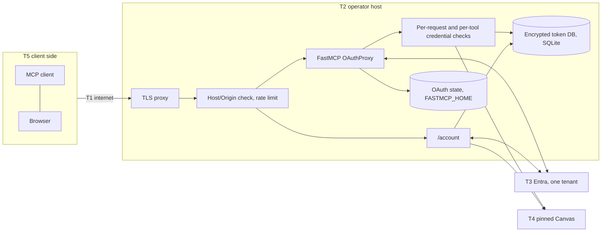

# Stage A: self-hosted multi-user pilot

Labels: **implemented** (the code does it), **tested** (a cited test exercises it), **documented** (a `deploy/selfhost/README.md` instruction the code cannot enforce), **unverified**.

**Evidence** ([appendix](stage-a-appendix.md)). CI run [37919990444](https://github.com/KKazuhaK/canvas-mcp/actions/runs/37919990444) (every job, including `test-locked`, `test-windows` and `test-postgres`) and image run [37919990428](https://github.com/KKazuhaK/canvas-mcp/actions/runs/37919990428) cover `f32b9d3`: G3 (`8d8ee28`, `01604b3`, `1f3a97d`), G4 (`5b89477`, `798959c`, `7aef784`, `c8a4a28`), the restart test (`bf703a6`), `SELFHOST_DISABLED_TOOLS` (`ff230fa`), and P3, an optional PostgreSQL data layer the pilot does not use (appendix §M).

## 1. Decision requested and gates

Agree that the pilot (§3) may run once G1 to G4 are met, and answer §10.

You wrote: "No credential-handling merge or deployment without independent security review by someone other than the implementation author." The author using the fork alone, with only the author's own Entra and Canvas accounts, is not the pilot: no other person's credentials are involved. The pilot starts with the first other user, only after G1 and G2. **If you want no live use at all before review, say so (Q2).**

| Gate | Requirement | Status |
|---|---|---|
| **G1** Independent review | Someone other than the author reviews the OAuth dependency behaviour (appendix §G), the credential-handling code paths and the pilot configuration (§10), not only this document | **Not met.** The author has no candidate; please recommend one (§10). |
| **G2** Institutional authority | The pinned Canvas institution's position on third-party storage of student tokens, and its education-record rules (FERPA in the US), recorded on #484 | **Not met.** No institutional approval recorded. |
| **G3** Pre-pilot OAuth fixes | Four items (appendix §G.1, tests §L) | **Done.** CI green at `f32b9d3` on fastmcp 4.0.3 and 4.1.0 |
| **G4** Request-local course state | The default in `entra-oauth` | **Done.** Same CI run |

Largest residuals: the operator can decrypt every token (§6); the model can disclose what it reads (§5); Entra role removal waits for the token lifetime (§7); off-Canvas download hops are not DNS/IP-restricted (§5); most FastMCP OAuth behaviour was read, not tested.

G3 leaves one finding: FastMCP **keeps the first redemption's tokens and revokes no refresh family** (§5).

**Unverified:** all live acceptance; live Entra behaviour (v2 issuer, guest `tid`, the tenant's token lifetime, Entra's own refresh-token reuse); a real JWKS `kid` rollover; every FastMCP behaviour marked *read* (against 4.0.3 only); the concurrent-refresh race; upgrading a running deployment's stored OAuth state; your focused command on Linux and Python 3.12 outside CI. Full list at the top of the appendix.

## 2. Your five security requirements

| # | Your requirement | What answers it | Status |
|---|---|---|---|
| 1 | Revocation is an authorization decision | Durable `principal_status`, apart from token rows, checked on `/account`, in the enrollment transaction, and per MCP request and tool call. Disable moves a session epoch; only an owner or operator re-enables; self-disconnect is not revocation. **Your reproduction is refused.** | tested |
| 2 | State bound to the credential | A per-principal generation guards state that outlives a request (confirmations, health verdicts, refresh tasks, `per_principal` caches). The pilot keeps no course state past the request (§7). Another Canvas user's token needs a confirmation. Entra roles confer no Canvas permission. | tested |
| 3 | OAuth review of actual dependencies | Appendix §G, *tested* and *read* separate. **Your `cull()` failure is fixed** (`py-key-value-aio>=0.4.6`). Product code uses public `client_storage`. | partly tested |
| 4 | Custody beyond encrypted SQLite | Inventory (appendix §E); README boundary corrected (§6) | documented |
| 5 | Constrained destinations | One pinned `CANVAS_API_URL`, one tenant, no multi-school, same-origin pagination; download hops a residual (§5) | tested; residual stated |
| — | Your failing run (1,062 passed, 1 failed) | `test_expired_oauth_records_are_deleted_from_disk` passes; A1 (§9) | tested (CI) |

Your item-1 test list is mapped in appendix §A.1. Restarts are tested in CI at store, middleware and whole-stack level (appendix §A.1); the last (`bf703a6`, `tests/test_multiuser_e2e.py::TestMcpAsTwoUsers::test_an_administrative_disable_survives_a_process_restart`) rebuilds store, caches, FastMCP server and ASGI app over the same database: the disabled user's old bearer and session are refused, another user's still work. Upgrade behaviour: §1, *Unverified*.

## 3. Pilot scope and configuration

| Dimension | Pilot value | Status |
|---|---|---|
| Scope | Invite-only: the author plus at most five named students who reply "I agree" to the consent text (appendix §C.2), for four weeks. No public hosted service, no production rollout. Only the count is posted. | documented |
| Canvas | `CANVAS_API_URL` only, verbatim. No multi-school settings. | tested |
| Identity | One tenant GUID, aliases refused. Assignment required. Guests only if invited and assigned. | GUID: tested. Assignment: documented. Guest `tid`: unverified. |
| Process | One container, one uvicorn process | documented |
| Storage | `DATABASE_URL` unset: SQLite, `/data/canvas-mcp/tokens.sqlite3`. P3's PostgreSQL backend is not used. | default tested; PostgreSQL out of scope |
| Other | Course state `request_local` (G4 default); anonymization on; truncation off (`MCP_MAX_RESULT_CHARS=0`) | tested; anonymization coverage unverified |
| Tools | `CANVAS_ROLE=student`, HTTP default policy: no write tool, no student or educator mutations, no `execute_typescript`, no hosted file writes | tested |
| `read_course_file_text` | **Excluded** (`SELFHOST_DISABLED_TOOLS=read_course_file_text`): it parses other people's PDF, PPTX and DOCX (A2) in the process holding the key ring. `read_course_file` runs the same parsers for web, Desktop and mobile, so this narrows the parser exposure, not removes it (Q5). | removal and refusal tested (CI); parser exposure not assessed |

The full `.env` and the settings that must stay unset (seven refused at startup) are in appendix §C.1.

**Image.** The pilot pins `ghcr.io/kkazuhak/canvas-mcp@sha256:f34608fcceccc63ca6189a3c963f96353cda0e40bda277f559c7b2790e4952d2`, the `:edge` multi-arch index (linux/amd64, arm64) image run 37919990428 published for `f32b9d3`, not the compose file's `:latest`, which predates these commits (appendix §I.1). The React UI is built into the image but not served.

**Scale.** `8f1b0ae..f32b9d3`: 279 files, +58,771 / −909 (appendix §N). You counted 4,401 lines in 12 files at `230788e`; `core/selfhost/` is now 30 files, +10,412 (9,819 without the inert `schools.py` and `tool_prefs.py`): review fixes, token-health checks, write-tool switches and, since `c8a4a28`, P3's `core/selfhost/db/` (13 files, +2,507), which the pilot runs on SQLite.

## 4. Data flow and trust boundaries



Code, in `core/selfhost/`: `edge_guard.py`, `request_context.py` and `tool_gate.py` (checks), `token_store.py` over `db/` (token DB). T1 to T5 are defined in §5.

MCP sign-in uses the proxy's own S256 leg to Entra and returns a FastMCP JWT (`aud = PUBLIC_BASE_URL/mcp`). `/account` verifies the `id_token`, checks the PAT with `/users/self` (no redirects) and encrypts it with AAD (principal, host, key id). Each tool call re-verifies tokens, claims and access status (appendix §D).

## 5. Threat model summary

Trust boundaries: T1 the internet, T2 the operator host, T3 Entra, T4 the pinned Canvas, T5 the client side. Actors: A1 another pilot user; A2 a malicious Canvas content author; A3 a malicious client registrant; A4 a network attacker; A5 operator or host compromise; A6 an Entra admin mistake. The full table is appendix §F.

| Threat | Mitigation | Status | Residual |
|---|---|---|---|
| Host spoofing, forged bearer, wrong tenant, client or role | Host/Origin pinning; FastMCP JWTs only; upstream token re-verified; claim checks | tested | Role removal waits for the token lifetime |
| Cross-user state, another user's token (A1) | `oid` and AAD binding; generation-keyed state; request-local course state | tested | Pending confirmations, access decisions and health verdicts are held in process-wide maps keyed by principal and generation in every mode; pending confirmations are unused in the pilot because it has no write tool |
| Fallback to a server credential | Refused at startup; HTTP fails closed | tested | none known |
| Prompt injection (A2) | Read tools only; content fenced | tested: no write tool is exposed | **The model can disclose what it reads, in its answer or through another connector** |
| Malicious client (A3) | Redirect allowlist, consent, S256 only, one-use codes | tested (G3) | Loopback redirects match any port; no adversarial consent test; a replayed code leaves its first tokens valid |
| Leaked MCP refresh token (A3, A4) | Rotation; reuse refused; disable stops the whole family | tested (G3) | **No family revocation.** Two simultaneous refreshes may both succeed (read, untested). |
| CIMD SSRF (A3) | FastMCP SSRF-safe fetch; trust-proxy switch refused | refusal tested; fetch *read* | No SSRF test |
| Requests off the pinned Canvas | Verbatim URL; same-origin pagination; probes without redirects; no credentials off Canvas | tested (appendix §F row 13) | **Download hops off Canvas are not DNS/IP-restricted** (`read_course_file`); accepted, as the redirect comes from the pinned Canvas and upstream has no host check either. An egress firewall would help (undocumented). |
| Entra removal (A6) | Disable first; a failed refresh cuts the user off | fake Entra only | **Bounded by the tenant's token lifetime** (Microsoft's 60 to 90 minute default is not a ceiling) |
| Operator or host (A5) | Out of reach; hardened container | config checked (compose lint) | **Full.** Stated in the consent text. |

Smaller residuals (stale owner flags, bare ids in FastMCP logs, the 5 s CLI delay, global rate limits): appendix §F.

## 6. Custody

Encryption protects a database or backup leak **without** `.env`. Whoever holds both `.env` and `/data` (operator, host root, the Docker group, a combined backup), or a compromised runtime, can decrypt every token and act in Canvas as that user. Owner pages hiding tokens is UI only.

| Asset | Key point |
|---|---|
| Canvas PATs (`/data/canvas-mcp/tokens.sqlite3`, AES-256-GCM) | Bytes may survive in free pages, the WAL and backups. **Only revocation in Canvas makes a token worthless.** |
| Upstream Entra tokens (Fernet, under `FASTMCP_HOME`) | **Signing-key rotation leaves the old directory. Delete it manually.** |
| `ACCOUNT_SESSION_SECRET` | **Owner-equivalent**: it can forge any session |
| Plaintext metadata (names, UPN, Canvas id, history) | Exposed by a database-only leak. No purge command. |

Canvas content is not written to disk by design (`read_course_file` downloads into memory). The root filesystem is read-only and `/tmp` is tmpfs (config checked), but `/data` is writable and no test shows that no content reaches it.

## 7. Lifecycle and revocation contract

States S0 to S3 (S3 disabled: 403 before credentials load): appendix §J.1.

| Transition | Who | Guarantee |
|---|---|---|
| Enroll or replace | User | A different Canvas user needs a confirmation. Generation +1. |
| Self-disconnect, remove | User, owner, operator | **Not revocation.** Generation +1. |
| Disable | Active owner (not self, not the last owner) or operator | One transaction: epoch, generation, event. Immediate in-process, **within 5 s from the CLI**. Survives a process restart (store, middleware and whole stack; CI, §2). **Your reproduction is refused** (tested). |
| Re-enable | Owner or operator, **never the user** | Old sessions stay dead |
| Entra role removed | Entra admin | Token-lifetime bound. **Disable first.** Fake Entra only. |

**In flight.** Checks run before each HTTP request and tool call, never inside one: **a running call finishes, may make further Canvas reads with the old token, and is not cancelled.**

**Course state.** With `request_local`, the course list, aliases, policy decisions, pseudonyms and discussion hints die with the request: the first two as upstream (#480), the other three **stricter** than upstream, which keeps them in process-wide maps shared by all callers (`course_policy._policy_cache` by course id, `anonymization._anonymization_cache` by real id, `discussions._unservable_topics` by prefix and topic id; re-checked at `8f1b0ae`). `per_principal` is opt-in. Cost: extra `/courses` reads when a tool names a course by code or title.

**Restore.** A restore rewinds decisions and generations: re-apply disablements and restart (documented, not enforced). A newer schema is refused and there is no downgrade, so a rollback needs the pre-upgrade backup; migration runs automatically at startup by default, so copy `/data` before changing the digest.

## 8. Dependencies, operator requirements, legacy modes

Ranges (locked / unpinned CI): fastmcp `>=4.0.3,<5` (4.0.3 / 4.1.0), mcp `>=2,<3` (2.1.1 / 2.3.0), and direct `py-key-value-aio[filetree]>=0.4.6,<0.5` (0.4.6; fixes `cull()`) and `cryptography>=44.0.0,<51` (50.0.0 / 50.0.2); appendix §H. These ranges would reach stdio users. P3's optional extras do not: `selfhost` (SQLAlchemy `>=2.1.3,<2.2`, Alembic `>=1.19,<2`) and `postgres` (psycopg[binary] `>=3.3,<4`). The image installs both (locked 2.1.4, 1.20.0, 3.3.6), so psycopg ships unused. The full suite passes on both version sets in CI. For *read* behaviours, see §1.

**Entra and host** (appendix §H, documented): a single-tenant app, **Assignment required**, v2 tokens; one replica; a TLS proxy that forwards `Host` (421 enforced), logs no query strings and limits per IP; the hardened non-root container (editable); `.env` apart from `/data`.

**Legacy modes.** `MCP_AUTH_MODE` defaults to `legacy`, whose auth branches are unchanged (tested); legacy startup still imports selfhost `settings`, `schools`, `tool_prefs` and `token_store` (plus the standard-library-only `db/__init__.py`, `db/url.py` and `db/errors.py`), never SQLAlchemy, Alembic or psycopg (tested). The fork's changes to every mode (truncation, `read_course_file_text`, upload checks, `core/redact.py`, G4's shared-code edits) are **not proposed** (appendix §C.3).

**Alternatives** (appendix §B). Local stdio stays the recommended default. An external OAuth gateway is not evaluated; §7 and appendix §I.4 are its bar (Q3). The standard-header alias is a separate, optional PR, and an organization-wide header is not per-user identity. Scoped developer-key OAuth (#236) is complementary; PAT support is retained.

## 9. Acceptance

A1 is your focused command, on Linux and Python 3.12, after `uv sync --locked --extra documents --extra selfhost --extra postgres --group dev --python 3.12` (the `test-locked` sync line, with `--python 3.12` in place of its `UV_PYTHON=3.14`; appendix §I.2):

```bash
uv run --locked pytest -q tests/selfhost tests/test_multiuser_e2e.py tests/test_selfhost_docs.py \
  tests/test_selfhost_compose.py tests/test_selfhost_dockerfile.py --tb=short
```

| Step | Expected |
|---|---|
| A1 | At `f32b9d3`: 2,126 passed, 12 skipped, 0 failed (**local**, Windows 11, Python 3.14.7, project venv). Passes inside the CI full suite (Linux, 3.11 to 3.14). **Linux and Python 3.12 outside CI: not run.** |
| A2: full suite as `test-locked`, with `FASTMCP_MCP_CAMELCASE_COMPAT=false`, as in CI (appendix §I.2) | `f32b9d3` (CI run 37919990444): 5,905 passed, 29 skipped (`test-windows`: 5,903, 31). `test-postgres` (the self-hosted suite on a real PostgreSQL service; outside the pilot): 1,991 passed, 65 skipped. |
| B: container smoke test | Passed at `f32b9d3` (image run 37919990428, amd64 and arm64); checks in appendix §I.3 |
| C: live L1 to L16 (web, Desktop, mobile, Claude Code) | **Unverified.** Before G1 and G2, only the author's own-account steps (appendix §I.4). |

**Exit:** L1 to L16 pass on web and Claude Code plus Desktop or mobile, or each failure has an accepted cause; no cross-user data; no secret in logs beyond the counted bare-id exception; L13 within its bound. Four weeks; stops if a user asks. Rollback: appendix §I.7 (nothing upstream).

## 10. Ownership and open questions

| Item | Proposal |
|---|---|
| Owner, backup | @KKazuhaK until the Stage C decision, at most six months after the pilot starts. **No backup; bus factor 1**, so upstream should own nothing yet. |
| Dependencies, security contact | Lock and image refreshed within 7 days of a security release; Dependabot version updates run weekly against the fork's default branch `main`, not `uci-student`, and Dependabot security updates are off; the author refreshes `uci-student`'s `uv.lock` and the image digest by hand. Private vulnerability reporting is enabled on the fork: <https://github.com/KKazuhaK/canvas-mcp/security/advisories/new> |
| Incident | Target (single operator, no backup): within 24 h, disable everyone and stop the container; within 72 h, notify users and post on #484. An unreachable operator means the pilot is stopped; the author stops the container before any absence over 24 h. |
| G1 reviewer | Not identified, and the author has no candidate. Please recommend someone with OAuth/Entra experience who has not contributed to this code, or approve one the author proposes later (scope: appendix §G.3). |
| If Stage C proceeds | No Stage C commitment is made now. The code stays in the fork and the author maintains it there; Stage C is proposed again only after the pilot and the independent review. |
| Asked of upstream | Review only: no operating, hosting, maintaining or merging; no public hosted service or production rollout (§3). |

**Defaults unless you object:** `read_course_file_text` excluded; off-Canvas download hops accepted (§5, your requirement 5); anonymization on; SQLite; the 5 s bound; four weeks; a pinned digest; no generic OIDC layer.

1. **Location.** These files stay in the fork (`proposals/selfhost-pilot/`). Upstream, where? `docs/` is published as the site root at the repository's CNAME (`/llms.txt` is served from it), so: `internal/`, `security/`, a new `proposals/`, or #484 only?
2. **Review gate.** Is the author's own-account use before G1 acceptable, or do you want no live use at all before review?
3. **Gateway.** Do you want an external OAuth gateway evaluated before the pilot?
4. **Stage B.** Do you want the `repr=False` PR (appendix §K) now, the redact work at all, and an issue about upstream's caller-shared policy cache?
5. **`read_course_file_text`.** Include it? Excluding it costs page ranges and, in Claude Code, PPTX and DOCX text; web, Desktop and mobile still get full text from `read_course_file` (§3).
6. **Evidence.** Is web and Claude Code plus one of Desktop or mobile enough?
